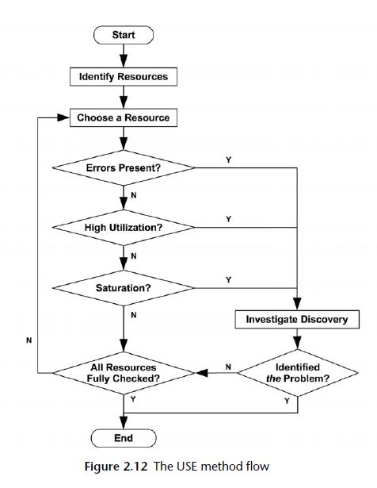

Container Based Troubleshooting Environment
---

- [Perforamence Term](#perforamence-term)
- [Performance Methodologies](#performance-methodologies)
  - [USE Method](#use-method)
- [BPF tool based debugging environment](#bpf-tool-based-debugging-environment)
  - [Customize Bpf Container image](#customize-bpf-container-image)
  - [Start bpf container](#start-bpf-container)
  - [Run Bpf tools](#run-bpf-tools)
  - [NOTE](#note)
- [Network tool based debugging environment](#network-tool-based-debugging-environment)
- [Linux ELF Symbol Debugging Tools](#linux-elf-symbol-debugging-tools)
- [Internal References](#internal-references)
- [External References](#external-references)

As you know following container widely usage and security concern that most of debugging tools are removed from container image. But debugging is always there because there is no software w/o bug in the world. And it is not allowed to install debugging tools into target machine. In order to solve this issue, this project help to build debugging environment w/o intall tools into target machine.

Now this project supports:
* BPF tool based debugging environment
* Network tool based debugging environment

# Perforamence Term
* SUT: System Under Test (受测系统)
* USE: Utilization Saturation errors (使用率，饱和度，错误)

# Performance Methodologies
## USE Method

* Resource
  * Hardware(CPU, memory, bus ...), software -> Metrics
    * CPU
    * Memory
    * Network Interface
    * Storage
    * Controller: storage, network
    * Interconnect: cpu, memory, io
  * Software
    * Mutex Locks
    * Thread Pools
    * Process/Thread Capacity
    * File Descriptor Capacity
* 
* Metrics
  * Utilization
  * Saturation
  
    Waiting queue... means it is saturation

  * Erros
  
* Procedure
  
  Error is first

  

Detail finformation please refer [Performance Concept](docs/perf_concept.md)
  
# BPF tool based debugging environment
## Customize Bpf Container image
1. Copy Config-* used by target host to this repos images/config/.
  
2. Add New Dockerfile same like with Dockerfile.centos.7.6.1810.kernel.4.18.0 and then update COPY cmd, And then update Kernel URL, Last run "docker build -t xxx:yyy -f ./Dockerfile.mmm ."

Please refer to [Dockerfile](images/Dockerfile.centos.7.6.1810.kernel.4.18.0)

Or 
1. ./bpfbld -k 4.18.0-193.el8.x86_64 -p 10.158.100.2:8080 -s 7.6.1810 -t bpftools:7.6.1810-4.18.0-20210201

Please refer to [Dockerfile](images/Dockerfile) and [Build Tool](bin/bpfbld)

## Start bpf container
```
cd bin
./bpfcli <imageid> <host|container:cid>

./bpfcli  bpftools:7.6.1810-4.18.0-210126 host
./bpfcli bpftools:7.6.1810-4.18.0-20210127 container:9b53698015727fc31241a5b02dfc135552f5af600b85047dcd0e4c3299cba754
```

## Run Bpf tools
```
/usr/share/bpftrace/tools/killsnoop.bt
```

## NOTE
* kprobe: SyS_execve -- __64_sys_execve
```
/usr/share/bpftrace/tools/execsnoop.bt
/*kprobe:SyS_execve*/
kprobe:__x64_sys_execve
{
        printf("%-10u %-5d ", elapsed / 1e6, pid);
        join(arg1);
}
```

# Network tool based debugging environment
The following tools now are covered in this image:
* lsof
* strace
* tcpdump
* atop
* iftop
* htop
* iotop
* nethogs
* iperf3
* qperf
* iproute/iproute-tc
* iputils
* net-tools
* traceroute
* bind-utils
* ethtool
* nmap/nmap-ncat
* nmon

For Dockerfile please refer to [Dockerfile](images/Dockerfile.nettools.7.6.1810)

# Linux ELF Symbol Debugging Tools
* nm
* objdump
* strings
* addr2line
* readelf

Above tools location: binutils-2.27-43.base.el7_8.1.x86_64

For detail please refer to:
* [ELF Debugging Tools](docs/elf.md)
* [GNU Binary Utilities](https://docs.adacore.com/live/wave/binutils-stable/html/binutils/binutils.html)

# Internal References
*  [BPF Basic Concept](docs/concepts.md)
*  [BCC Basic](docs/bcc.md)
*  [BPFtrace Basic](docs/bpftrace.md)
*  [CPU Perforamnce Debugging](docs/cpu_debug.md)
*  [MEM Perforamnce Debugging](docs/mem_debug.md)
*  [Network Perforance Debugging](docs/network_debug.md)
*  [Disk Performance Debugging](docs/disk_debug.md)
*  [Network Debuging Tools](docs/nettools.md)
*  [Generic Debugging Tips](docs/tips.md)

# External References
* [BPF Perf Tools Book Page](https://github.com/brendangregg/bpf-perf-tools-book)
* [Brendan Gregg's Perf Tools](https://github.com/brendangregg/perf-tools)
* [Brendan Greggs's Homepage](http://www.brendangregg.com/)
