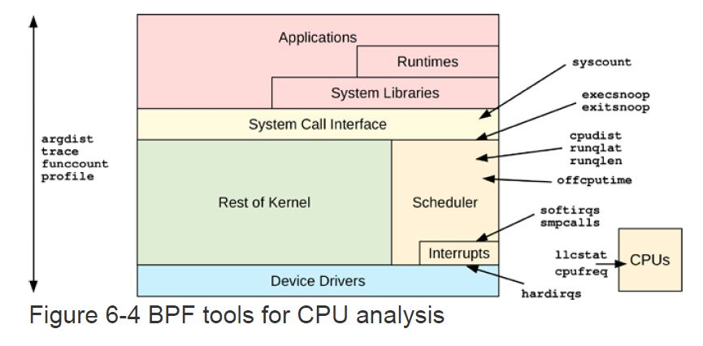

CPU Perforamnce Debugging
---
- [CPU Basic](#cpu-basic)
  - [CPU Running Mode](#cpu-running-mode)
  - [CPU Scheduler](#cpu-scheduler)
  - [Preempt](#preempt)
  - [CPU Cache](#cpu-cache)
- [CPU Classical Tools](#cpu-classical-tools)
- [BPF Tools](#bpf-tools)


# CPU Basic
## CPU Running Mode
  * System Mode
    * Kernel
      * CPU 
      * all other kinds of resources
      * 系统内核一般按需运行
        * 系统调用
        * 处理中断
        * backend线程
  * User Mode
    * User App
      * Send Request to Kerenl to access all resoure
        * 显示请求
          * syscall
        * 隐式请求
          * 缺页中断(page fault)
## CPU Scheduler

  * Schedule Unit
    * thread/task
    * Interrupt Hander(hardware interrupt, softare interrupt)
  * Task Running State
    * ON-PROC: running on the cpu
    * RUNNABLE: waiting in run queue
    * SLEEP: waiting for other events including uninterruptable thread
  * Terms
    * VCX
      * Voluntary(自愿) Context Switch
        ```bsh
        [root@foss-ssc-7 cbte]# cat /proc/1618299/status | grep switch
        voluntary_ctxt_switches:        16421
        nonvoluntary_ctxt_switches:     0
        ```
      * i/o
      * sleep
    * ICX
      * Involuntary(强制) Context Switch
      * Preempt
    * Priority
      * Increase task running performance
    * Linux CFS
## Preempt
* 触发抢占：对正在CPU上运行的线程设置请求重新调度的标志(TIF_NEED_RESCHED)
  * 周期性的时钟中断
    * timer interrupt handler call scheduler_tick to check if time slicing is over, if yes, set TIF_NEED_RESCHED
  * Thread Wakeup 
    * 当进程被唤醒时，如果进程的优先级高于CPU上的当前进程，then set TIF_NEED_RECHED
  * 进程修改nice值时
    * if new nice导致优先级高于CPU上的当前进程，then set TIF_NEED_RECHED
  * 进行负载均衡时
    * migration to another CPU
  * 
* 执行抢占: when kernel found TIF_NEED_RESCHED flag is set then 执行抢占
  * 执行User Preempt(用户态抢占)时机
    * 系统调用(syscall)返回用户态时
    * 中断调用(Interrupt)返回用户态时
  * 执行Kernel Preempt(内核态抢占)时机
    * 
* Reference
  * [Preempt Kernel Internal](preempt_internal.md)
  * http://linuxperf.com/?p=211

## CPU Cache

* Level 1
  * 指令缓存(I$)
  * 数据缓存(D$)
  * Size: KB
  * Speed: 纳秒
* Level 2
* Level 3 (LLC)
  * Size: MB
* Level1/2: CPU独占
* Level3: CPU共享

# CPU Classical Tools
* uptime
  ```bash
  [root@foss-ssc-7 /]# uptime
   02:51:56 up 64 days, 23:55,  0 users,  load average: 0.28, 0.52, 0.85
  [root@foss-ssc-7 /]#
  ```  
* top
  ```bash
  top - 03:13:18 up 65 days, 17 min,  0 users,  load average: 0.25, 0.26, 0.40
  Tasks: 461 total,   2 running, 278 sleeping,   0 stopped,   0 zombie
  %Cpu(s):  0.6 us,  0.2 sy,  0.0 ni, 99.1 id,  0.0 wa,  0.1 hi,  0.0 si,  0.0 st
  KiB Mem : 65653516 total,  7867848 free,  4495004 used, 53290664 buff/cache
  KiB Swap:        0 total,        0 free,        0 used. 55522072 avail Mem

      PID USER      PR  NI    VIRT    RES    SHR S  %CPU %MEM     TIME+ COMMAND
     1624 root      20   0 5481128 158220  66676 S  13.6  0.2   9272:49 kubelet
     6995 root      20   0 4019568  78104  38832 S   3.3  0.1   2906:12 calico-node
     1622 root      20   0 5705020 140644  41112 S   2.3  0.2   2496:46 dockerd
     7944 root      20   0 1539028  86440  26560 S   2.0  0.1   1358:23 python3
  3567103 1000      20   0  741404  36584   8652 S   1.3  0.1 634:48.70 katib-controlle
     3320 999       20   0  747896  58532  26132 S   1.0  0.1 131:21.82 calico-typha
     6423 153       20   0  741596 543860  40000 S   1.0  0.8   2172:28 prometheus
    ```
* mpstat
  ```bash
  [root@foss-ssc-7 /]# mpstat -u -P ALL
  Linux 4.18.0-193.el8.x86_64 (foss-ssc-7)        02/03/21        _x86_64_        (32 CPU)

  03:15:43     CPU    %usr   %nice    %sys %iowait    %irq   %soft  %steal  %guest  %gnice   %idle
  03:15:43     all    0.67    0.00    0.27    0.01    0.06    0.05    0.00    0.00    0.00   98.95
  03:15:43       0    0.71    0.00    0.56    0.01    0.05    0.42    0.00    0.00    0.00   98.26
  03:15:43       1    0.77    0.00    0.28    0.01    0.05    0.10    0.00    0.00    0.00   98.80
  03:15:43       2    0.76    0.00    0.28    0.01    0.05    0.05    0.00    0.00    0.00   98.84
  03:15:43       3    0.76    0.00    0.28    0.01    0.05    0.04    0.00    0.00    0.00   98.85
  03:15:43       4    0.76    0.00    0.28    0.01    0.05    0.04    0.00    0.00    0.00   98.86
  03:15:43       5    0.75    0.00    0.28    0.01    0.05    0.04    0.00    0.00    0.00   98.87
  03:15:43       6    0.75    0.00    0.28    0.01    0.05    0.04    0.00    0.00    0.00   98.88
  03:15:43       7    0.75    0.00    0.28    0.01    0.05    0.04    0.00    0.00    0.00   98.88
  03:15:43       8    0.60    0.00    0.24    0.00    0.06    0.03    0.00    0.00    0.00   99.06
  03:15:43       9    0.59    0.00    0.24    0.00    0.06    0.02    0.00    0.00    0.00   99.08
  03:15:43      10    0.59    0.00    0.24    0.00    0.06    0.02    0.00    0.00    0.00   99.08
  03:15:43      11    0.59    0.00    0.24    0.00    0.06    0.03    0.00    0.00    0.00   99.07
  03:15:43      12    0.52    0.00    0.22    0.00    0.08    0.03    0.00    0.00    0.00   99.14
  03:15:43      13    0.59    0.00    0.24    0.00    0.06    0.03    0.00    0.00    0.00   99.08
  03:15:43      14    0.59    0.00    0.24    0.00    0.06    0.03    0.00    0.00    0.00   99.07
  03:15:43      15    0.59    0.00    0.24    0.00    0.06    0.03    0.00    0.00    0.00   99.08
  03:15:43      16    0.76    0.00    0.28    0.01    0.05    0.03    0.00    0.00    0.00   98.87
  03:15:43      17    0.75    0.00    0.28    0.01    0.05    0.05    0.00    0.00    0.00   98.86
  ```
* perf
  ```bash
  [root@foss-ssc-7 /]# perf list | more
    branch-instructions OR branches                    [Hardware event]
    branch-misses                                      [Hardware event]
    bus-cycles                                         [Hardware event]
    cache-misses                                       [Hardware event]
    cache-references                                   [Hardware event]
    cpu-cycles OR cycles                               [Hardware event]
    instructions                                       [Hardware event]
    ref-cycles                                         [Hardware event]
    stalled-cycles-backend OR idle-cycles-backend      [Hardware event]
    stalled-cycles-frontend OR idle-cycles-frontend    [Hardware event]
    alignment-faults                                   [Software event]
    bpf-output                                         [Software event]
    context-switches OR cs                             [Software event]
    cpu-clock                                          [Software event]
    cpu-migrations OR migrations                       [Software event]
    dummy                                              [Software event]
    emulation-faults                                   [Software event]
    major-faults                                       [Software event]
    minor-faults                                       [Software event]
    page-faults OR faults                              [Software event]
    task-clock                                         [Software event]
    L1-dcache-load-misses                              [Hardware cache event]
    L1-dcache-loads                                    [Hardware cache event]
    L1-dcache-prefetch-misses                          [Hardware cache event]
    L1-dcache-store-misses                             [Hardware cache event]
    L1-dcache-stores                                   [Hardware cache event]
  ```
* ftrace
  
# BPF Tools


* execsnoop
  
  跟踪全系统新进程执行信息的工具
  * 用来找到<span style="color:red">消耗大量CPU的**短期进程**</span>
  * 用来分析软件的执行过程

  例子：
  ```bash
  [root@foss-ssc-7 /]# execsnoop -T
  TIME     PCOMM            PID    PPID   RET ARGS
  05:51:27 calico           2076662 1624     0 /opt/cni/bin/calico
  05:51:27 portmap          2076673 1624     0 /opt/cni/bin/portmap
  05:51:31 runc             2076678 6850     0 /usr/sbin/runc --root /var/run/docker/runtime-runc/moby --log /run/containerd/io.containerd.runtime.v1.linux/moby/03abae249faaa2d829a4b1fd2e5607e64cd512969e8ab574bdce57705e8f80e2/log.json --log-format json --systemd-cgroup state 03abae249faaa2d829a4b1fd2e5607e64cd512969e8ab574bdce57705e8f80e2
  05:51:31 runc             2076684 6850     0 /usr/sbin/runc --root /var/run/docker/runtime-runc/moby --log /run/containerd/io.containerd.runtime.v1.linux/moby/03abae249faaa2d829a4b1fd2e5607e64cd512969e8ab574bdce57705e8f80e2/log.json --log-format json --systemd-cgroup exec --process /tmp/runc-process404143201 --detach --pid-file /run/containerd/io.containerd.runtime.v1.linux/moby/03abae249faaa2d829a4b1fd2e5607e64cd512969e8ab574bdce57705e8f80e2/ada76f873ce 03abae249faaa2d829a4b1fd2e5607e64cd512969e8ab574bdce57705e8f80e2
  05:51:31 exe              2076691 2076684   0 /proc/self/exe init
  05:51:31 calico-node      2076693 2076684   0 /bin/calico-node -bird-ready -felix-ready
  ```
* exitsnoop

  例子
  ```
  [root@foss-ssc-7 /]# exitsnoop -t --per-thread
  TIME-UTC     PCOMM            PID    PPID   TID    AGE(s)  EXIT_CODE
  05:54:42.828 runc             4294967295 0      0      5626720.71 0
  05:54:42.828 runc             4294967295 0      0      5626720.71 0
  05:54:42.829 runc             4294967295 0      0      5626720.71 0
  05:54:42.829 runc             4294967295 0      0      5626720.71 0
  05:54:42.829 runc             4294967295 0      0      5626720.71 0
  05:54:42.829 runc             17     0      0      5626720.71 0
  05:54:42.872 runc:[1:CHILD]   17     0      0      5626720.76 0
  05:54:42.872 runc:[0:PARENT]  17     0      0      5626720.76 0
  ```

* runqlat
  ```bash
  [root@foss-ssc-7 /]# runqlat.bt
  Attaching 5 probes...
  Tracing CPU scheduler... Hit Ctrl-C to end.
  ^C

  @usecs:
  [0]                17823 |@@@@@@                                              |
  [1]               139697 |@@@@@@@@@@@@@@@@@@@@@@@@@@@@@@@@@@@@@@@@@@@@@@@@@@@@|
  [2, 4)             68411 |@@@@@@@@@@@@@@@@@@@@@@@@@                           |
  [4, 8)             45430 |@@@@@@@@@@@@@@@@                                    |
  [8, 16)            53050 |@@@@@@@@@@@@@@@@@@@                                 |
  [16, 32)           42188 |@@@@@@@@@@@@@@@                                     |
  [32, 64)           25968 |@@@@@@@@@                                           |
  [64, 128)          14256 |@@@@@                                               |
  [128, 256)           581 |                                                    |
  [256, 512)           243 |                                                    |
  [512, 1K)            275 |                                                    |
  [1K, 2K)             273 |                                                    |
  [2K, 4K)              52 |                                                    |
  [4K, 8K)              15 |                                                    |
  [8K, 16K)             18 |                                                    |
  [16K, 32K)             2 |                                                    |
  [32K, 64K)             7 |                                                    |
  [64K, 128K)           87 |                                                    |
  [128K, 256K)           0 |                                                    |
  [256K, 512K)           0 |                                                    |
  [512K, 1M)             0 |                                                    |
  [1M, 2M)               0 |                                                    |
  [2M, 4M)               0 |                                                    |
  [4M, 8M)               0 |                                                    |
  [8M, 16M)              0 |                                                    |
  [16M, 32M)             0 |                                                    |
  [32M, 64M)             0 |                                                    |
  [64M, 128M)            1 |                                                    |
  ```
* runqlen
* runqslower
* cpudist
* cpufreq
* profile
* offcputime
* syscount
* argdist
* trace
* funccount
* softirqs
* hardirqs
* smpcalls
* llcstat