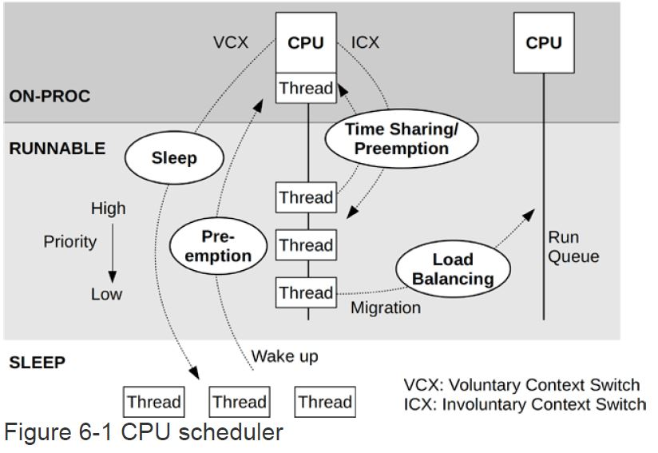
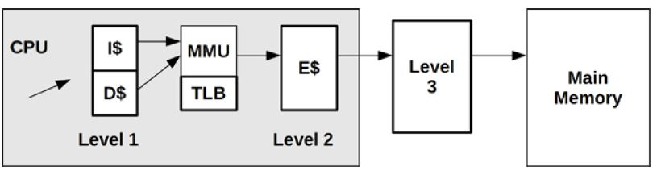

CPU Perforamnce Debugging
---
- [CPU Basic](#cpu-basic)
  - [CPU Concept](#cpu-concept)
  - [CPU Running Mode](#cpu-running-mode)
  - [CPU Scheduler](#cpu-scheduler)
  - [Preempt](#preempt)
  - [CPU Cache](#cpu-cache)
- [CPU Classical Tools](#cpu-classical-tools)
- [BPF Tools](#bpf-tools)
- [Performance Optimization](#performance-optimization)
  - [nice and rtprio](#nice-and-rtprio)
  - [task affinity (taskset util-linux rpm)](#task-affinity-taskset-util-linux-rpm)
  - [独占CPU组 (cpuset)](#独占cpu组-cpuset)
  - [资源控制 - cgroup](#资源控制---cgroup)


# CPU Basic
## CPU Concept
* 时钟频率： 
  
  CPU是以一个特定的时钟频率来执行，例如 **5GHz** CPU 代表每秒运行**50亿个时钟周期**。 一个CPU指令可能需要一个或多个时钟周期执行

  变频：提高或降低CPU时钟频率可增加或降低能耗

* 指令（指令集）
  
  一个指令包含一下步骤：每一个都有CPU上的功能单元的组件处理，每一步至少需要一个时钟周期执行
  * 指令预取
  * 指令解码
  * 执行
  * 内存访问（optional）
  * 寄存器写（optional）

* 指令流水线
  
  一种CPU架构，通过执行不同指令的不同步骤来达到同时执行多个指令的结果

* 指令宽度

  同时执行CPU指令的个数
  
* CPI，IPC
  
  CPI -- Cycle per Instruction
  IPC -- Instruction per Cycle

  CPI = 1 / IPC

* 使用率

  内核时间和用户时间两个指标

  CPU使用率包含所有符合条件活动的时钟周期（包括内存停滞周期），所以有可能由于等待IO而导致高使用率而不仅仅在执行指令

* 饱和度
  
  100%CPU被称为饱和的

* 抢占
  
* 优先级反转
  
* 多进程/多线程
  
* dd
## CPU Running Mode
  * System Mode
    * Kernel
      * CPU 
      * all other kinds of resources
      * 系统内核一般按需运行
        * 系统调用H
        * 处理中断
        * backend线程
  * User Mode
    * User App
      * Send Request to Kerenl to access all resoure
        * 显示请求
          * syscall
        * 隐式请求
          * 缺页中断(page fault)
## CPU Scheduler

  * Schedule Unit
    * thread/task
    * Interrupt Hander(hardware interrupt, softare interrupt)
  * Task Running State
    * ON-PROC: running on the cpu
    * RUNNABLE: waiting in run queue
    * SLEEP: waiting for other events including uninterruptable thread
  * Terms
    * VCX
      * Voluntary(自愿) Context Switch
        ```bsh
        [root@foss-ssc-7 cbte]# cat /proc/1618299/status | grep switch
        voluntary_ctxt_switches:        16421
        nonvoluntary_ctxt_switches:     0
        ```
      * i/o
      * sleep
    * ICX
      * Involuntary(强制) Context Switch
      * Preempt
    * Priority
      * Increase task running performance
    * Linux CFS
## Preempt
* 触发抢占：对正在CPU上运行的线程设置请求重新调度的标志(TIF_NEED_RESCHED)
  * 周期性的时钟中断
    * timer interrupt handler call scheduler_tick to check if time slicing is over, if yes, set TIF_NEED_RESCHED
  * Thread Wakeup 
    * 当进程被唤醒时，如果进程的优先级高于CPU上的当前进程，then set TIF_NEED_RECHED
  * 进程修改nice值时
    * if new nice导致优先级高于CPU上的当前进程，then set TIF_NEED_RECHED
  * 进行负载均衡时
    * migration to another CPU
  * 
* 执行抢占: when kernel found TIF_NEED_RESCHED flag is set then 执行抢占
  * 执行User Preempt(用户态抢占)时机
    * 系统调用(syscall)返回用户态时
    * 中断调用(Interrupt)返回用户态时
  * 执行Kernel Preempt(内核态抢占)时机
    * 
* Reference
  * [Preempt Kernel Internal](preempt_internal.md)
  * http://linuxperf.com/?p=211

## CPU Cache

* Level 1
  * 指令缓存(I$)
  * 数据缓存(D$)
  * Size: KB
  * Speed: 纳秒
* Level 2
* Level 3 (LLC)
  * Size: MB
* Level1/2: CPU独占
* Level3: CPU共享

# CPU Classical Tools
* uptime

  检查负载的平均数，负载平均数超过CPU个数通常代表CPU饱和. 1, 5, 15分钟的平均负载

  ```bash
  [root@foss-ssc-7 /]# uptime
   02:51:56 up 64 days, 23:55,  0 users,  load average: 0.28, 0.52, 0.85
  [root@foss-ssc-7 /]#
  ```  
* top
  ```bash
  top - 03:13:18 up 65 days, 17 min,  0 users,  load average: 0.25, 0.26, 0.40
  Tasks: 461 total,   2 running, 278 sleeping,   0 stopped,   0 zombie
  %Cpu(s):  0.6 us,  0.2 sy,  0.0 ni, 99.1 id,  0.0 wa,  0.1 hi,  0.0 si,  0.0 st
  KiB Mem : 65653516 total,  7867848 free,  4495004 used, 53290664 buff/cache
  KiB Swap:        0 total,        0 free,        0 used. 55522072 avail Mem

      PID USER      PR  NI    VIRT    RES    SHR S  %CPU %MEM     TIME+ COMMAND
     1624 root      20   0 5481128 158220  66676 S  13.6  0.2   9272:49 kubelet
     6995 root      20   0 4019568  78104  38832 S   3.3  0.1   2906:12 calico-node
     1622 root      20   0 5705020 140644  41112 S   2.3  0.2   2496:46 dockerd
     7944 root      20   0 1539028  86440  26560 S   2.0  0.1   1358:23 python3
  3567103 1000      20   0  741404  36584   8652 S   1.3  0.1 634:48.70 katib-controlle
     3320 999       20   0  747896  58532  26132 S   1.0  0.1 131:21.82 calico-typha
     6423 153       20   0  741596 543860  40000 S   1.0  0.8   2172:28 prometheus
    ```
* vmstat
  * Normal mode
    ```
    [root@foss-ssc-1 src]# vmstat -w 1
    procs -----------------------memory---------------------- ---swap-- -----io---- -system-- --------cpu--------
    r  b         swpd         free         buff        cache   si   so    bi    bo   in   cs  us  sy  id  wa  st
    0  0            0     26882752         2232      3577584    0    0     5     7   60   11   3   2  96   0   0
    0  0            0     26882556         2232      3577604    0    0     0    67 6732 14675   4   1  95   0   0
    ```
    r: 代表**所有等待+正在运行的线程数**

  * Disk Mode
    ```
    [root@foss-ssc-1 src]# vmstat -dw 1
    disk- -------------------reads------------------- -------------------writes------------------ ------IO-------
              total    merged     sectors          ms     total    merged     sectors          ms     cur     sec
    sda       16855        65     3348654      135279    274935      3733     4668692       30662       0     120
    dm-0      15871         0     3247712      114734    277393         0     4651967       29387       0     119
    dm-1         97         0        4184        1005         0         0           0           0       0       0
    dm-2        260         0       12436        1952      1076         0       16589           9       0       0
    sda       16855        65     3348654      135279    274948      3733     4668828       30663       0     120
    dm-0      15871         0     3247712      114734    277406         0     4652103       29387       0     119
    dm-1         97         0        4184        1005         0         0           0           0       0       0
    dm-2        260         0       12436        1952      1076         0       16589           9       0       0
    sda       16855        65     3348654      135279    274949      3733     4668956       30663       0     120
    dm-0      15871         0     3247712      114734    277407         0     4652231       29387       0     119
    dm-1         97         0        4184        1005         0         0           0           0       0       0
    dm-2        260         0       12436        1952      1076         0       16589           9       0       0
    ```
```
FIELD DESCRIPTION FOR VM MODE
   Procs
       r: The number of runnable processes (running or waiting for run time).
       b: The number of processes in uninterruptible sleep.

   Memory
       swpd: the amount of virtual memory used.
       free: the amount of idle memory.
       buff: the amount of memory used as buffers.
       cache: the amount of memory used as cache.
       inact: the amount of inactive memory.  (-a option)
       active: the amount of active memory.  (-a option)

   Swap
       si: Amount of memory swapped in from disk (/s).
       so: Amount of memory swapped to disk (/s).

   IO
       bi: Blocks received from a block device (blocks/s).
       bo: Blocks sent to a block device (blocks/s).

   System
       in: The number of interrupts per second, including the clock.
       cs: The number of context switches per second.

   CPU
       These are percentages of total CPU time.
       us: Time spent running non-kernel code.  (user time, including nice time)
       sy: Time spent running kernel code.  (system time)
       id: Time spent idle.  Prior to Linux 2.5.41, this includes IO-wait time.
       wa: Time spent waiting for IO.  Prior to Linux 2.5.41, included in idle.
       st: Time stolen from a virtual machine.  Prior to Linux 2.6.11, unknown.

FIELD DESCRIPTION FOR DISK MODE
   Reads
       total: Total reads completed successfully
       merged: grouped reads (resulting in one I/O)
       sectors: Sectors read successfully
       ms: milliseconds spent reading

   Writes
       total: Total writes completed successfully
       merged: grouped writes (resulting in one I/O)
       sectors: Sectors written successfully
       ms: milliseconds spent writing

   IO
       cur: I/O in progress
       s: seconds spent for I/O

FIELD DESCRIPTION FOR DISK PARTITION MODE
       reads: Total number of reads issued to this partition
       read sectors: Total read sectors for partition
       writes : Total number of writes issued to this partition
       requested writes: Total number of write requests made for partition

FIELD DESCRIPTION FOR SLAB MODE
       cache: Cache name
       num: Number of currently active objects
       total: Total number of available objects
       size: Size of each object
       pages: Number of pages with at least one active object
```
* pidstat (sysstat rpm)

  Report statistics for Linux tasks

  ```
    -t     Also display statistics for threads associated with selected tasks.
           This option adds the following values to the reports:
            TGID
                The identification number of the thread group leader.
            TID
                The identification number of the thread being monitored.

  ```
  * CPU statistics
    ```
    [root@foss-ssc-1 ~]# pidstat -p 17096 1
    Linux 4.18.0-193.14.2.el8_2.x86_64 (foss-ssc-1)         05/07/21        _x86_64_        (12 CPU)

    13:23:49      UID       PID    %usr %system  %guest   %wait    %CPU   CPU  Command
    13:23:50      543     17096    0.00    0.00    0.00    0.00    0.00     0  sla-monitoring
    13:23:51      543     17096    0.00    0.00    0.00    0.00    0.00     0  sla-monitoring
    13:23:52      543     17096    0.00    0.00    0.00    0.00    0.00     0  sla-monitoring
    13:23:53      543     17096    0.00    0.00    0.00    0.00    0.00     0  sla-monitoring
    13:23:54      543     17096    0.00    0.00    0.00    0.00    0.00     0  sla-monitoring
    13:23:55      543     17096    0.00    0.00    0.00    0.00    0.00     0  sla-monitoring
    13:23:56      543     17096    0.00    0.00    0.00    0.00    0.00     0  sla-monitoring
    13:23:57      543     17096    0.00    0.00    0.00    0.00    0.00     0  sla-monitoring
    13:23:58      543     17096    0.00    0.00    0.00    0.00    0.00     0  sla-monitoring
    13:23:59      543     17096    0.00    0.00    0.00    0.00    0.00     0  sla-monitoring
    13:24:00      543     17096    0.00    0.00    0.00    0.00    0.00     0  sla-monitoring
    13:24:01      543     17096    0.00    0.00    0.00    0.00    0.00     0  sla-monitoring
    13:24:02      543     17096    0.00    0.00    0.00    0.00    0.00     0  sla-monitoring
    13:24:03      543     17096    2.00    1.00    0.00    0.00    3.00     1  sla-monitoring
    13:24:04      543     17096    0.00    0.00    0.00    0.00    0.00     1  sla-monitoring
    ```
    ```
    [root@foss-ssc-1 ~]# pidstat --human -t -u -p 17089 1
    Linux 4.18.0-193.14.2.el8_2.x86_64 (foss-ssc-1)         05/07/21        _x86_64_        (12 CPU)

    13:49:05      UID      TGID       TID    %usr %system  %guest   %wait    %CPU   CPU  Command
    13:49:06      543     17089         -    0.0%    0.0%    0.0%    0.0%    0.0%    10  sla-monitoring
    13:49:06      543         -     17089    0.0%    0.0%    0.0%    0.0%    0.0%    10  |__sla-monitoring
    13:49:06      543         -     17090    0.0%    0.0%    0.0%    0.0%    0.0%     0  |__civetweb-master
    13:49:06      543         -     17091    0.0%    0.0%    0.0%    0.0%    0.0%    11  |__civetweb-worker
    13:49:06      543         -     17092    0.0%    0.0%    0.0%    0.0%    0.0%     0  |__civetweb-worker
    13:49:06      543         -     17093    0.0%    0.0%    0.0%    0.0%    0.0%     3  |__sla-monitoring
    13:49:06      543         -     17094    0.0%    0.0%    0.0%    0.0%    0.0%     0  |__sla-monitoring
    13:49:06      543         -     17095    0.0%    0.0%    0.0%    0.0%    0.0%     0  |__sla-monitoring
    13:49:06      543         -     17096    0.0%    0.0%    0.0%    0.0%    0.0%     6  |__sla-monitoring
    13:49:06      543         -     17097    0.0%    0.0%    0.0%    0.0%    0.0%     5  |__sla-monitoring
    13:49:06      543         -     17098    0.0%    0.0%    0.0%    0.0%    0.0%     8  |__sla-monitoring

    13:49:06      UID      TGID       TID    %usr %system  %guest   %wait    %CPU   CPU  Command
    13:49:07      543     17089         -    1.0%    0.0%    0.0%    0.0%    1.0%    10  sla-monitoring
    13:49:07      543         -     17089    0.0%    0.0%    0.0%    0.0%    0.0%    10  |__sla-monitoring
    13:49:07      543         -     17090    0.0%    0.0%    0.0%    0.0%    0.0%     0  |__civetweb-master
    13:49:07      543         -     17091    0.0%    0.0%    0.0%    0.0%    0.0%    11  |__civetweb-worker
    13:49:07      543         -     17092    0.0%    0.0%    0.0%    0.0%    0.0%     0  |__civetweb-worker
    13:49:07      543         -     17093    0.0%    0.0%    0.0%    0.0%    0.0%     3  |__sla-monitoring
    13:49:07      543         -     17094    0.0%    0.0%    0.0%    0.0%    0.0%     0  |__sla-monitoring
    13:49:07      543         -     17095    0.0%    0.0%    0.0%    0.0%    0.0%     0  |__sla-monitoring
    13:49:07      543         -     17096    0.0%    0.0%    0.0%    0.0%    0.0%     6  |__sla-monitoring
    13:49:07      543         -     17097    0.0%    0.0%    0.0%    0.0%    0.0%     5  |__sla-monitoring
    13:49:07      543         -     17098    0.0%    0.0%    0.0%    0.0%    0.0%     8  |__sla-monitoring
    ``` 

    CPU: Processor number to which the task is attached.

  * Disk Statistics
    ```
    [root@foss-ssc-1 ~]# pidstat -d -p 17096 1
    Linux 4.18.0-193.14.2.el8_2.x86_64 (foss-ssc-1)         05/07/21        _x86_64_        (12 CPU)

    13:27:45      UID       PID   kB_rd/s   kB_wr/s kB_ccwr/s iodelay  Command
    13:27:46      543     17096      0.00      0.00      0.00       0  sla-monitoring
    13:27:47      543     17096      0.00      0.00      0.00       0  sla-monitoring
    13:27:48      543     17096      0.00     60.00     60.00       0  sla-monitoring
    13:27:49      543     17096      0.00      0.00      0.00       0  sla-monitoring
    13:27:50      543     17096      0.00      0.00      0.00       0  sla-monitoring
    13:27:51      543     17096      0.00      0.00      0.00       0  sla-monitoring
    13:27:52      543     17096      0.00      0.00      0.00       0  sla-monitoring
    13:27:53      543     17096      0.00      0.00      0.00       0  sla-monitoring
    ```
    * kB_ccwr/s
      ```
      Number of kilobytes whose writing to disk has been cancelled by the task. This may occur when the task truncates some dirty pagecache. In this case, some IO which another task has been accounted for will not be happening.
      ```

    * iodelay
      ```
      Block I/O delay of the task being monitored, measured in clock ticks. This metric includes the delays spent waiting for sync block I/O completion and for swapin block I/O completion
      ```
  * Prio/Policy 
    ```
    [root@foss-ssc-1 ~]# pidstat -R -p 17089 1
    Linux 4.18.0-193.14.2.el8_2.x86_64 (foss-ssc-1)         05/07/21        _x86_64_        (12 CPU)

    13:35:00      UID       PID prio policy  Command
    13:35:01      543     17089    0 NORMAL  sla-monitoring
    13:35:02      543     17089    0 NORMAL  sla-monitoring
    13:35:03      543     17089    0 NORMAL  sla-monitoring
    13:35:04      543     17089    0 NORMAL  sla-monitoring
    13:35:05      543     17089    0 NORMAL  sla-monitoring
    ```
  * page faults and memory utilization
    ```
    [root@foss-ssc-1 ~]# pidstat --human -r -p 17089 1
    Linux 4.18.0-193.14.2.el8_2.x86_64 (foss-ssc-1)         05/07/21        _x86_64_        (12 CPU)

    13:42:19      UID       PID  minflt/s  majflt/s     VSZ     RSS   %MEM  Command
    13:42:20      543     17089      0.00      0.00  840.2M  233.6M   0.7%  sla-monitoring
    13:42:21      543     17089      0.00      0.00  840.2M  233.6M   0.7%  sla-monitoring
    13:42:22      543     17089      0.00      0.00  840.2M  233.6M   0.7%  sla-monitoring
    ^C
    Average:      543     17089      0.00      0.00  840.2M  233.6M   0.7%  sla-monitoring
    ```
    ```
    When reporting statistics for individual tasks, the following values may be displayed:

    minflt/s
      Total number of minor faults the task has made per second, those which have not required loading a memory page from disk.

    majflt/s
      Total number of major faults the task has made per second, those which have required loading a memory page from disk.

    VSZ
      Virtual Size: The virtual memory usage of entire task in kilobytes.

    RSS
      Resident Set Size: The non-swapped physical memory used by the task in kilobytes.

    %MEM
      The tasks's currently used share of available physical memory.

    When reporting global statistics for tasks and all their children, the following values may be displayed:

    minflt-nr
      Total number of minor faults made by the task and all its children, and collected during the interval of time.

    majflt-nr
      Total number of major faults made by the task and all its children, and collected during the interval of time.
    ```
    ```
    [root@foss-ssc-1 ~]# pidstat --human -T ALL -r -p 17089 1
    Linux 4.18.0-193.14.2.el8_2.x86_64 (foss-ssc-1)         05/07/21        _x86_64_        (12 CPU)

    13:44:56      UID       PID  minflt/s  majflt/s     VSZ     RSS   %MEM  Command
    13:44:57      543     17089     42.57      0.00  840.2M  233.9M   0.7%  sla-monitoring

    13:44:56      UID       PID minflt-nr majflt-nr  Command
    13:44:57      543     17089        43         0  sla-monitoring

    13:44:57      UID       PID  minflt/s  majflt/s     VSZ     RSS   %MEM  Command
    13:44:58      543     17089      0.00      0.00  840.2M  233.9M   0.7%  sla-monitoring

    13:44:57      UID       PID minflt-nr majflt-nr  Command
    13:44:58      543     17089         0         0  sla-monitoring
    ^C

    Average:      UID       PID  minflt/s  majflt/s     VSZ     RSS   %MEM  Command
    Average:      543     17089      7.65      0.00  840.2M  233.9M   0.7%  sla-monitoring

    Average:      UID       PID minflt-nr majflt-nr  Command
    Average:      543     17089         8         0  sla-monitoring
    ```
  * stack utilization
    ```
    [root@foss-ssc-1 ~]# pidstat --human -s -p 17089 1
    Linux 4.18.0-193.14.2.el8_2.x86_64 (foss-ssc-1)         05/07/21        _x86_64_        (12 CPU)

    13:43:45      UID       PID StkSize  StkRef  Command
    13:43:46      543     17089  132.0k   36.0k  sla-monitoring
    13:43:47      543     17089  132.0k   36.0k  sla-monitoring
    13:43:48      543     17089  132.0k   36.0k  sla-monitoring
    13:43:49      543     17089  132.0k   36.0k  sla-monitoring
    ^C
    Average:      543     17089  132.0k   36.0k  sla-monitoring
    ```
  *  Report values of some kernel tables
     ```
     [root@foss-ssc-1 ~]# pidstat --human -v -p 17089 1
      Linux 4.18.0-193.14.2.el8_2.x86_64 (foss-ssc-1)         05/07/21        _x86_64_        (12 CPU)

      13:51:31      UID       PID threads   fd-nr  Command
      13:51:32      543     17089      10      21  sla-monitoring
      13:51:34      543     17089      10      21  sla-monitoring
      13:51:35      543     17089      10      21  sla-monitoring
      13:51:36      543     17089      10      21  sla-monitoring
      13:51:37      543     17089      10      21  sla-monitoring
      13:51:38      543     17089      10      21  sla-monitoring
     ```
     ```
      threads
          Number of threads associated with current task.
      fd-nr
          Number of file descriptors associated with current task.
     ```
  * Report task switching activity
    ```
    [root@foss-ssc-1 ~]# pidstat --human -w -p 17089 1
    Linux 4.18.0-193.14.2.el8_2.x86_64 (foss-ssc-1)         05/07/21        _x86_64_        (12 CPU)

    13:53:47      UID       PID   cswch/s nvcswch/s  Command
    13:53:48      543     17089      0.00      0.00  sla-monitoring
    13:53:49      543     17089      0.00      0.00  sla-monitoring
    13:53:50      543     17089      0.00      0.00  sla-monitoring
    13:53:51      543     17089      0.00      0.00  sla-monitoring
    ```
    ```
    cswch/s
      Total number of voluntary context switches the task made per second.  A voluntary context switch occurs when a task blocks because it requires a resource that is unavailable.

    nvcswch/s
      Total number of non voluntary context switches the task made per second.  A involuntary context switch takes place when a task executes for the duration of its time slice and then is forced  to  relinquish  the processor.

    ```
* mpstat

  Report processors related statistics

  -A     This option is equivalent to specifying -n -u -I ALL -N ALL -P ALL

  * CPU Utilization Report
    ```
    [root@foss-ssc-7 /]# mpstat -u -P ALL
    Linux 4.18.0-193.el8.x86_64 (foss-ssc-7)        02/03/21        _x86_64_        (32 CPU)

    03:15:43     CPU    %usr   %nice    %sys %iowait    %irq   %soft  %steal  %guest  %gnice   %idle
    03:15:43     all    0.67    0.00    0.27    0.01    0.06    0.05    0.00    0.00    0.00   98.95
    03:15:43       0    0.71    0.00    0.56    0.01    0.05    0.42    0.00    0.00    0.00   98.26
    03:15:43       1    0.77    0.00    0.28    0.01    0.05    0.10    0.00    0.00    0.00   98.80
    03:15:43       2    0.76    0.00    0.28    0.01    0.05    0.05    0.00    0.00    0.00   98.84
    03:15:43       3    0.76    0.00    0.28    0.01    0.05    0.04    0.00    0.00    0.00   98.85
    03:15:43       4    0.76    0.00    0.28    0.01    0.05    0.04    0.00    0.00    0.00   98.86
    03:15:43       5    0.75    0.00    0.28    0.01    0.05    0.04    0.00    0.00    0.00   98.87
    03:15:43       6    0.75    0.00    0.28    0.01    0.05    0.04    0.00    0.00    0.00   98.88
    03:15:43       7    0.75    0.00    0.28    0.01    0.05    0.04    0.00    0.00    0.00   98.88
    03:15:43       8    0.60    0.00    0.24    0.00    0.06    0.03    0.00    0.00    0.00   99.06
    03:15:43       9    0.59    0.00    0.24    0.00    0.06    0.02    0.00    0.00    0.00   99.08
    03:15:43      10    0.59    0.00    0.24    0.00    0.06    0.02    0.00    0.00    0.00   99.08
    03:15:43      11    0.59    0.00    0.24    0.00    0.06    0.03    0.00    0.00    0.00   99.07
    03:15:43      12    0.52    0.00    0.22    0.00    0.08    0.03    0.00    0.00    0.00   99.14
    03:15:43      13    0.59    0.00    0.24    0.00    0.06    0.03    0.00    0.00    0.00   99.08
    03:15:43      14    0.59    0.00    0.24    0.00    0.06    0.03    0.00    0.00    0.00   99.07
    03:15:43      15    0.59    0.00    0.24    0.00    0.06    0.03    0.00    0.00    0.00   99.08
    03:15:43      16    0.76    0.00    0.28    0.01    0.05    0.03    0.00    0.00    0.00   98.87
    03:15:43      17    0.75    0.00    0.28    0.01    0.05    0.05    0.00    0.00    0.00   98.86
    ```
  * Interrupt Report

    ```
    mpstat -I ALL 1
    ...
    14:24:28     CPU       HI/s    TIMER/s   NET_TX/s   NET_RX/s    BLOCK/s IRQ_POLL/s  TASKLET/s    SCHED/s  HRTIMER/s      RCU/s
    14:24:28       0       0.00     231.89       0.00      26.59       0.75       0.00       0.58     175.41       0.00     154.74
    14:24:28       1       0.00     205.32       0.00      27.22       0.74       0.00       0.14     117.54       0.00     132.30
    14:24:28       2       0.00     207.55       0.00      26.70       0.75       0.00       1.10     101.51       0.00     133.54
    14:24:28       3       0.00     205.61       0.18      26.27       0.80       0.00       0.52      95.01       0.00     133.03
    14:24:28       4       0.00     203.64       0.00      25.77       0.74       0.00       0.36      90.78       0.00     131.81
    14:24:28       5       0.00     209.38       0.00      26.90       0.77       0.00       0.35      93.12       0.00     134.33
    14:24:28       6       0.00     204.69       0.00      17.67       0.79       0.00       0.10      89.83       0.00     132.09
    14:24:28       7       0.00     204.56       0.00      25.30       0.77       0.00       0.65      89.22       0.00     132.79
    14:24:28       8       0.00     203.24       0.00      26.28       0.81       0.00       0.66      88.32       0.00     132.12
    14:24:28       9       0.00     199.86       0.00      28.76       0.80       0.00       0.27      87.83       0.00     132.21
    14:24:28      10       0.00     201.24       0.00      27.59       0.78       0.00       0.33      87.19       0.00     131.90
    14:24:28      11       0.00     202.91       0.21      28.16       0.81       0.00       0.97      88.38       0.00     133.18
    ```
  * Node Level CPU Utilization
    ```
    [root@foss-ssc-1 ~]# mpstat -N ALL
    Linux 4.18.0-193.14.2.el8_2.x86_64 (foss-ssc-1)         05/07/21        _x86_64_        (12 CPU)

    14:29:14    NODE    %usr   %nice    %sys %iowait    %irq   %soft  %steal  %guest  %gnice   %idle
    14:29:14     all    2.49    0.00    1.18    0.01    0.25    0.18    0.00    0.00    0.00   95.90
    14:29:14       0    2.49    0.00    1.18    0.01    0.25    0.18    0.00    0.00    0.00   95.90
    ```
* sar
  
  Collect, report, or save system activity information. It depends on sysstat.service


  ```
    -q  Report queue length and load averages. The following values are displayed:

      runq-sz
        Run queue length (number of tasks waiting for run time).

      plist-sz
        Number of tasks in the task list.

      ldavg-1
        System load average for the last minute.  The load average is calculated as the average number of runnable or running tasks (R state), and the  number  of  tasks  in  uninterruptible sleep (D state) over the specified interval.

      ldavg-5
        System load average for the past 5 minutes.

      ldavg-15
        System load average for the past 15 minutes.

      blocked
        Number of tasks currently blocked, waiting for I/O to complete.
  ```

  ```
  [root@foss-ssc-7 /]# sar -q 1
   Linux 4.18.0-193.el8.x86_64 (foss-ssc-7)        02/18/21        _x86_64_        (32 CPU)

   06:50:13      runq-sz  plist-sz   ldavg-1   ldavg-5  ldavg-15   blocked
   06:50:14            0      1196      0.03      0.10      0.15         0
   06:50:15            0      1196      0.03      0.10      0.15         0
   06:50:16            1      1196      0.03      0.10      0.15         0
   06:50:17            0      1196      0.03      0.10      0.15         0
   06:50:18            0      1196      0.03      0.10      0.15         0
   06:50:19            1      1196      0.03      0.10      0.15         0
   06:50:20            0      1196      0.02      0.09      0.15         0
   06:50:33            0      1194      0.02      0.09      0.14         0
   ^C

  06:50:33            0      1194      0.02      0.09      0.14         0
  Average:            0      1195      0.02      0.09      0.15         0
  ```
* perf
  ```bash
  [root@foss-ssc-7 /]# perf list | more
    branch-instructions OR branches                    [Hardware event]
    branch-misses                                      [Hardware event]
    bus-cycles                                         [Hardware event]
    cache-misses                                       [Hardware event]
    cache-references                                   [Hardware event]
    cpu-cycles OR cycles                               [Hardware event]
    instructions                                       [Hardware event]
    ref-cycles                                         [Hardware event]
    stalled-cycles-backend OR idle-cycles-backend      [Hardware event]
    stalled-cycles-frontend OR idle-cycles-frontend    [Hardware event]
    alignment-faults                                   [Software event]
    bpf-output                                         [Software event]
    context-switches OR cs                             [Software event]
    cpu-clock                                          [Software event]
    cpu-migrations OR migrations                       [Software event]
    dummy                                              [Software event]
    emulation-faults                                   [Software event]
    major-faults                                       [Software event]
    minor-faults                                       [Software event]
    page-faults OR faults                              [Software event]
    task-clock                                         [Software event]
    L1-dcache-load-misses                              [Hardware cache event]
    L1-dcache-loads                                    [Hardware cache event]
    L1-dcache-prefetch-misses                          [Hardware cache event]
    L1-dcache-store-misses                             [Hardware cache event]
    L1-dcache-stores                                   [Hardware cache event]
  ```
* ftrace
  
# BPF Tools


* execsnoop
  
  跟踪全系统新进程执行信息的工具
  * 用来找到<span style="color:red">消耗大量CPU的**短期进程**</span>
  * 用来分析软件的执行过程

  例子：
  ```bash
  [root@foss-ssc-7 /]# execsnoop -T
  TIME     PCOMM            PID    PPID   RET ARGS
  05:51:27 calico           2076662 1624     0 /opt/cni/bin/calico
  05:51:27 portmap          2076673 1624     0 /opt/cni/bin/portmap
  05:51:31 runc             2076678 6850     0 /usr/sbin/runc --root /var/run/docker/runtime-runc/moby --log /run/containerd/io.containerd.runtime.v1.linux/moby/03abae249faaa2d829a4b1fd2e5607e64cd512969e8ab574bdce57705e8f80e2/log.json --log-format json --systemd-cgroup state 03abae249faaa2d829a4b1fd2e5607e64cd512969e8ab574bdce57705e8f80e2
  05:51:31 runc             2076684 6850     0 /usr/sbin/runc --root /var/run/docker/runtime-runc/moby --log /run/containerd/io.containerd.runtime.v1.linux/moby/03abae249faaa2d829a4b1fd2e5607e64cd512969e8ab574bdce57705e8f80e2/log.json --log-format json --systemd-cgroup exec --process /tmp/runc-process404143201 --detach --pid-file /run/containerd/io.containerd.runtime.v1.linux/moby/03abae249faaa2d829a4b1fd2e5607e64cd512969e8ab574bdce57705e8f80e2/ada76f873ce 03abae249faaa2d829a4b1fd2e5607e64cd512969e8ab574bdce57705e8f80e2
  05:51:31 exe              2076691 2076684   0 /proc/self/exe init
  05:51:31 calico-node      2076693 2076684   0 /bin/calico-node -bird-ready -felix-ready
  ```
* exitsnoop
  
  跟踪进程的推出事件，打印进程的总<span style="color:red">**运行时长和退出原因**</span>

  例子
  ```
  [root@foss-ssc-7 /]# exitsnoop -t --per-thread
  TIME-UTC     PCOMM            PID    PPID   TID    AGE(s)  EXIT_CODE
  05:54:42.828 runc             4294967295 0      0      5626720.71 0
  05:54:42.828 runc             4294967295 0      0      5626720.71 0
  05:54:42.829 runc             4294967295 0      0      5626720.71 0
  05:54:42.829 runc             4294967295 0      0      5626720.71 0
  05:54:42.829 runc             4294967295 0      0      5626720.71 0
  05:54:42.829 runc             17     0      0      5626720.71 0
  05:54:42.872 runc:[1:CHILD]   17     0      0      5626720.76 0
  05:54:42.872 runc:[0:PARENT]  17     0      0      5626720.76 0
  ```

* runqlat
  ```bash
  [root@foss-ssc-7 /]# runqlat.bt
  Attaching 5 probes...
  Tracing CPU scheduler... Hit Ctrl-C to end.
  ^C

  @usecs:
  [0]                17823 |@@@@@@                                              |
  [1]               139697 |@@@@@@@@@@@@@@@@@@@@@@@@@@@@@@@@@@@@@@@@@@@@@@@@@@@@|
  [2, 4)             68411 |@@@@@@@@@@@@@@@@@@@@@@@@@                           |
  [4, 8)             45430 |@@@@@@@@@@@@@@@@                                    |
  [8, 16)            53050 |@@@@@@@@@@@@@@@@@@@                                 |
  [16, 32)           42188 |@@@@@@@@@@@@@@@                                     |
  [32, 64)           25968 |@@@@@@@@@                                           |
  [64, 128)          14256 |@@@@@                                               |
  [128, 256)           581 |                                                    |
  [256, 512)           243 |                                                    |
  [512, 1K)            275 |                                                    |
  [1K, 2K)             273 |                                                    |
  [2K, 4K)              52 |                                                    |
  [4K, 8K)              15 |                                                    |
  [8K, 16K)             18 |                                                    |
  [16K, 32K)             2 |                                                    |
  [32K, 64K)             7 |                                                    |
  [64K, 128K)           87 |                                                    |
  [128K, 256K)           0 |                                                    |
  [256K, 512K)           0 |                                                    |
  [512K, 1M)             0 |                                                    |
  [1M, 2M)               0 |                                                    |
  [2M, 4M)               0 |                                                    |
  [4M, 8M)               0 |                                                    |
  [8M, 16M)              0 |                                                    |
  [16M, 32M)             0 |                                                    |
  [32M, 64M)             0 |                                                    |
  [64M, 128M)            1 |                                                    |
  ```
* runqlen
* runqslower
  
  列出运行队列中等待运行延迟超过阈值的线程名字和延迟时长

* cpudist
  
  线程唤醒以后在CPU上执行的时长分布

  ```
  [root@foss-ssc-7 /]# cpudist
  Tracing on-CPU time... Hit Ctrl-C to end.
  ^C
      usecs               : count     distribution
          0 -> 1          : 38848    |******************************          |
          2 -> 3          : 21445    |****************                        |
          4 -> 7          : 51797    |****************************************|
          8 -> 15         : 20107    |***************                         |
          16 -> 31         : 31078    |***********************                 |
          32 -> 63         : 45409    |***********************************     |
          64 -> 127        : 41390    |*******************************         |
        128 -> 255        : 13898    |**********                              |
        256 -> 511        : 11634    |********                                |
        512 -> 1023       : 676      |                                        |
        1024 -> 2047       : 2        |                                        |
  [root@foss-ssc-7 /]#
  ```
* cpufreq
* profile
* offcputime
* syscount
* argdist
* trace
* funccount
* softirqs
* hardirqs
* smpcalls
* llcstat


# Performance Optimization
## nice and rtprio

* nice value 
  
-20 -------------- 19

PRI = -(nice - 19)

```
nice top
[root@foss-ssc-1 ~]# ps -eo pid,tid,class,rtprio,ni,pri,psr,pcpu,stat,wchan:14,comm | egrep -e "top|PID"
    PID     TID CLS RTPRIO  NI PRI PSR %CPU STAT WCHAN          COMMAND
3764826 3764826 TS       -  10   9   4  0.3 SN+  core_sys_selec top

nice -n -20 top
[root@foss-ssc-1 ~]# ps -eo pid,tid,class,rtprio,ni,pri,psr,pcpu,stat,wchan:14,comm | egrep -e "top|PID"
    PID     TID CLS RTPRIO  NI PRI PSR %CPU STAT WCHAN          COMMAND
3768259 3768259 TS       - -20  39   1  0.3 S<+  core_sys_selec top

nice -n 19 top
[root@foss-ssc-1 ~]# ps -eo pid,tid,class,rtprio,ni,pri,psr,pcpu,stat,wchan:14,comm | egrep -e "top|PID"
    PID     TID CLS RTPRIO  NI PRI PSR %CPU STAT WCHAN          COMMAND
3769659 3769659 TS       -  19   0   7  0.6 SN+  core_sys_selec top
[root@foss-ssc-1 ~]#
```

* rtprio value 

0 ----------- 100

PRI = rtprio + 40

```
    PID     TID CLS RTPRIO  NI PRI PSR %CPU STAT WCHAN          COMMAND
3826686 3826686 TS       - -20  39  11  0.6 S<+  core_sys_selec top

>>>> chrt -r -p 60 pid >>>>

    PID     TID CLS RTPRIO  NI PRI PSR %CPU STAT WCHAN          COMMAND
3826686 3826686 RR      60   - 100  11  0.4 S<+  core_sys_selec top
```

```
chrt [-f|-r] -p prio pid

chrt: failed to set pid 3811073's policy: Operation not permitted
sysctl -w kernel.sched_rt_runtime_us=-1
```

CPU Task Queue
```
CPUx 
     -- RR
        -- RTPRIOx 
        -- RTPRIOy 
        -- RTPRIOz
    -- FIFO
        -- RTPRIOx 
        -- RTPRIOy 
        -- RTPRIOz
    -- TS
       -- Queue 

1. low nice value takes up much more timeslice but all tasks shall be schedulled
2. High RTPRIO take high priority to run on CPU than low priority running on CPU, then low priority may not have chance to run on CPU when there is always high RTPRIO coming
```

## task affinity (taskset util-linux rpm)
* check task core affinity including its childs
  ```
  [root@foss-ssc-1 ~]# taskset -a -p 17089
    pid 17089's current affinity mask: fff
    pid 17090's current affinity mask: fff
    pid 17091's current affinity mask: fff
    pid 17092's current affinity mask: fff
    pid 17093's current affinity mask: fff
    pid 17094's current affinity mask: fff
    pid 17095's current affinity mask: fff
    pid 17096's current affinity mask: fff
    pid 17097's current affinity mask: fff
    pid 17098's current affinity mask: fff
  ```


* set affinity on cores
```
[root@foss-ssc-1 ~]# taskset -pc 1-3,6 17089
pid 17089's current affinity list: 0-11
pid 17089's new affinity list: 1-3,6
[root@foss-ssc-1 ~]# taskset -a -p 17089
pid 17089's current affinity mask: 4e
pid 17090's current affinity mask: fff
pid 17091's current affinity mask: fff
pid 17092's current affinity mask: fff
pid 17093's current affinity mask: fff
pid 17094's current affinity mask: fff
pid 17095's current affinity mask: fff
pid 17096's current affinity mask: fff
pid 17097's current affinity mask: fff
pid 17098's current affinity mask: fff
[root@foss-ssc-1 ~]# taskset -a -pc 1-3,6 17089
pid 17089's current affinity list: 1-3,6
pid 17089's new affinity list: 1-3,6
pid 17090's current affinity list: 0-11
pid 17090's new affinity list: 1-3,6
pid 17091's current affinity list: 0-11
pid 17091's new affinity list: 1-3,6
pid 17092's current affinity list: 0-11
pid 17092's new affinity list: 1-3,6
pid 17093's current affinity list: 0-11
pid 17093's new affinity list: 1-3,6
pid 17094's current affinity list: 0-11
pid 17094's new affinity list: 1-3,6
pid 17095's current affinity list: 0-11
pid 17095's new affinity list: 1-3,6
pid 17096's current affinity list: 0-11
pid 17096's new affinity list: 1-3,6
pid 17097's current affinity list: 0-11
pid 17097's new affinity list: 1-3,6
pid 17098's current affinity list: 0-11
pid 17098's new affinity list: 1-3,6
```
if task is affinity to cores on the same node then it will have high performance.

* Check which cpu task is running on
```
top -> f -> * P       = Last Used Cpu (SMP) -> q --> W (~/.toprc or /root/.config/procps/toprc)
```
```
top - 15:48:28 up 1 day,  7:11,  4 users,  load average: 0.83, 0.68, 0.60
Tasks: 306 total,   2 running, 304 sleeping,   0 stopped,   0 zombie
%Cpu(s):  2.2 us,  0.8 sy,  0.0 ni, 96.5 id,  0.0 wa,  0.2 hi,  0.2 si,  0.0 st
MiB Mem :  31986.3 total,  21569.0 free,   2472.4 used,   7944.9 buff/cache
MiB Swap:      0.0 total,      0.0 free,      0.0 used.  27651.1 avail Mem

    PID USER      PR  NI    VIRT    RES    SHR S  %CPU  %MEM     TIME+ COMMAND                                                                                                                                 P
   1325 root      20   0 3484476 135992  61124 S  24.8   0.4 201:22.72 kubelet                                                                                                                                 2
   1331 root      20   0 4336144 133456  42284 S   6.9   0.4  67:35.86 dockerd                                                                                                                                 1
   3144 root      20   0  640364 491836  69220 S   5.9   1.5 130:52.92 kube-apiserver                                                                                                                          7
   3156 root      20   0  214252 114452  54136 S   3.0   0.3  49:14.36 kube-controller                                                                                                                        10
   8105 root      20   0 2466076  63804  36992 S   3.0   0.2  54:13.69 calico-node                                                                                                                             5
```

## 独占CPU组 (cpuset)
cpuset - confine processes to processor and memory node subsets

```
[root@foss-ssc-1 cgroup]# pwd
/sys/fs/cgroup
[root@foss-ssc-1 cgroup]# for fn in $(find . -name "*cpus"); do cat $fn; done
0-11
0-11
0-11
0-11
...
```
```
       tasks  List of the process IDs (PIDs) of the processes in that cpuset.  The list is formatted as a series of ASCII decimal numbers, each followed by a newline.  A process may be added to a cpuset (automatically  removing  it
              from the cpuset that previously contained it) by writing its PID to that cpuset's tasks file (with or without a trailing newline).

              Warning: only one PID may be written to the tasks file at a time.  If a string is written that contains more than one PID, only the first one will be used.

       notify_on_release
              Flag  (0 or 1).  If set (1), that cpuset will receive special handling after it is released, that is, after all processes cease using it (i.e., terminate or are moved to a different cpuset) and all child cpuset direc‐
              tories have been removed.  See the Notify On Release section, below.

       cpuset.cpus
              List of the physical numbers of the CPUs on which processes in that cpuset are allowed to execute.  See List Format below for a description of the format of cpus.

              The CPUs allowed to a cpuset may be changed by writing a new list to its cpus file.

       cpuset.cpu_exclusive
              Flag (0 or 1).  If set (1), the cpuset has exclusive use of its CPUs (no sibling or cousin cpuset may overlap CPUs).  By default, this is off (0).  Newly created cpusets also initially default this to off (0).

              Two cpusets are sibling cpusets if they share the same parent cpuset in the /dev/cpuset hierarchy.  Two cpusets are cousin cpusets if neither is the ancestor of the other.  Regardless of the cpu_exclusive setting,  if
              one cpuset is the ancestor of another, and if both of these cpusets have nonempty cpus, then their cpus must overlap, because the cpus of any cpuset are always a subset of the cpus of its parent cpuset.

       cpuset.mems
              List of memory nodes on which processes in this cpuset are allowed to allocate memory.  See List Format below for a description of the format of mems.

       cpuset.mem_exclusive
              Flag (0 or 1).  If set (1), the cpuset has exclusive use of its memory nodes (no sibling or cousin may overlap).  Also if set (1), the cpuset is a Hardwall cpuset (see below).  By default, this is off (0).  Newly cre‐
              ated cpusets also initially default this to off (0).

              Regardless of the mem_exclusive setting, if one cpuset is the ancestor of another, then their memory nodes must overlap, because the memory nodes of any cpuset are always a subset of the memory nodes of that  cpuset's
              parent cpuset.

       cpuset.mem_hardwall (since Linux 2.6.26)
              Flag  (0  or  1).  If set (1), the cpuset is a Hardwall cpuset (see below).  Unlike mem_exclusive, there is no constraint on whether cpusets marked mem_hardwall may have overlapping memory nodes with sibling or cousin
              cpusets.  By default, this is off (0).  Newly created cpusets also initially default this to off (0).

       cpuset.memory_migrate (since Linux 2.6.16)
              Flag (0 or 1).  If set (1), then memory migration is enabled.  By default, this is off (0).  See the Memory Migration section, below.

       cpuset.memory_pressure (since Linux 2.6.16)
              A measure of how much memory pressure the processes in this cpuset are causing.  See the Memory Pressure section, below.  Unless memory_pressure_enabled is enabled, always has value zero (0).  This file is  read-only.
              See the WARNINGS section, below.

       cpuset.memory_pressure_enabled (since Linux 2.6.16)
              Flag  (0 or 1).  This file is present only in the root cpuset, normally /dev/cpuset.  If set (1), the memory_pressure calculations are enabled for all cpusets in the system.  By default, this is off (0).  See the Mem‐
              ory Pressure section, below.

       cpuset.memory_spread_page (since Linux 2.6.17)
              Flag (0 or 1).  If set (1), pages in the kernel page cache (filesystem buffers) are uniformly spread across the cpuset.  By default, this is off (0) in the top cpuset, and inherited from the  parent  cpuset  in  newly
              created cpusets.  See the Memory Spread section, below.

       cpuset.memory_spread_slab (since Linux 2.6.17)
              Flag (0 or 1).  If set (1), the kernel slab caches for file I/O (directory and inode structures) are uniformly spread across the cpuset.  By defaultBy default, is off (0) in the top cpuset, and inherited from the par‐
              ent cpuset in newly created cpusets.  See the Memory Spread section, below.

       cpuset.sched_load_balance (since Linux 2.6.24)
              Flag (0 or 1).  If set (1, the default) the kernel will automatically load balance processes in that cpuset over the allowed CPUs in that cpuset.  If cleared (0) the kernel will avoid load balancing processes in  this
              cpuset, unless some other cpuset with overlapping CPUs has its sched_load_balance flag set.  See Scheduler Load Balancing, below, for further details.
       cpuset.sched_relax_domain_level (since Linux 2.6.26)
              Integer,  between  -1 and a small positive value.  The sched_relax_domain_level controls the width of the range of CPUs over which the kernel scheduler performs immediate rebalancing of runnable tasks across CPUs.  If
              sched_load_balance is disabled, then the setting of sched_relax_domain_level  does  not  matter,  as  no  such  load  balancing  is  done.   If  sched_load_balance  is  enabled,  then  the  higher  the  value  of  the
              sched_relax_domain_level, the wider the range of CPUs over which immediate load balancing is attempted.  See Scheduler Relax Domain Level, below, for further details.

       In  addition  to  the  above  pseudo-files  in each directory below /dev/cpuset, each process has a pseudo-file, /proc/<pid>/cpuset, that displays the path of the process's cpuset directory relative to the root of the cpuset
       filesystem.

       Also the /proc/<pid>/status file for each process has four added lines, displaying the process's Cpus_allowed (on which CPUs it may be scheduled) and Mems_allowed (on which memory nodes it may obtain memory), in the two for‐
       mats Mask Format and List Format (see below) as shown in the following example:

           Cpus_allowed:   ffffffff,ffffffff,ffffffff,ffffffff
           Cpus_allowed_list:     0-127
           Mems_allowed:   ffffffff,ffffffff
           Mems_allowed_list:     0-63

       The "allowed" fields were added in Linux 2.6.24; the "allowed_list" fields were added in Linux 2.6.26.

```

```
[root@foss-ssc-1 17089]# cat cpuset
/kubepods.slice/kubepods-burstable.slice/kubepods-burstable-pod6b9b6470_5968_4381_9be4_5b230c1ac34f.slice/docker-fb454e27b425befdf8d845dfe3742883c8b60510c0259f9defdfc45267e6ff70.scope
[root@foss-ssc-1 17089]# pwd
/proc/17089
[root@foss-ssc-1 17089]# cat status
...
Cpus_allowed:   0000004e
Cpus_allowed_list:      1-3,6
...
```

## 资源控制 - cgroup

