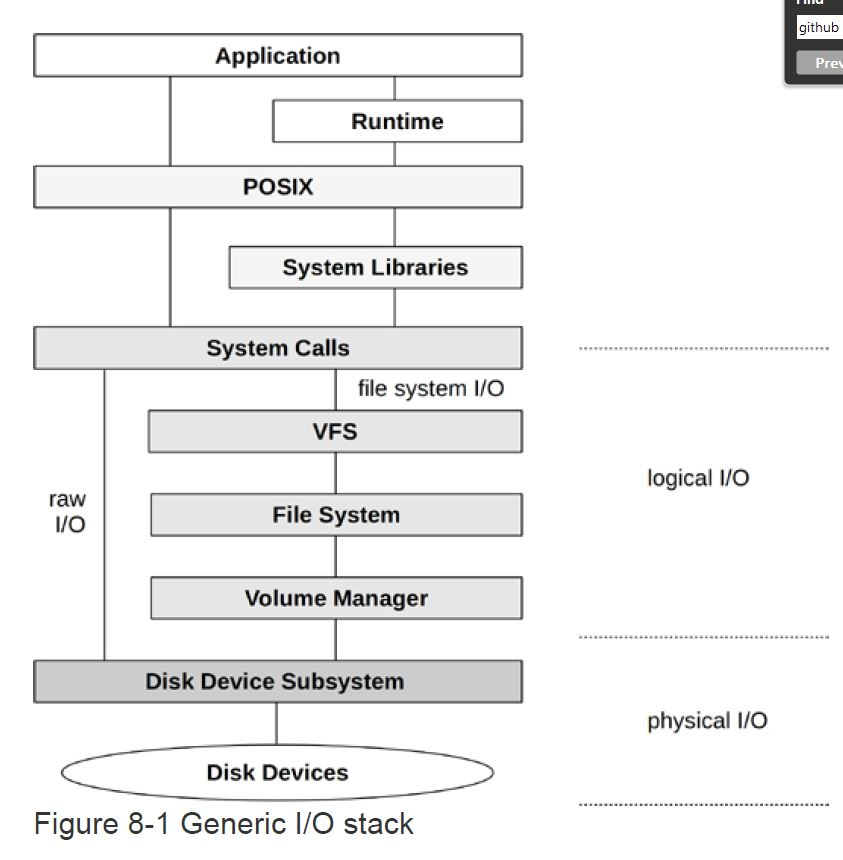
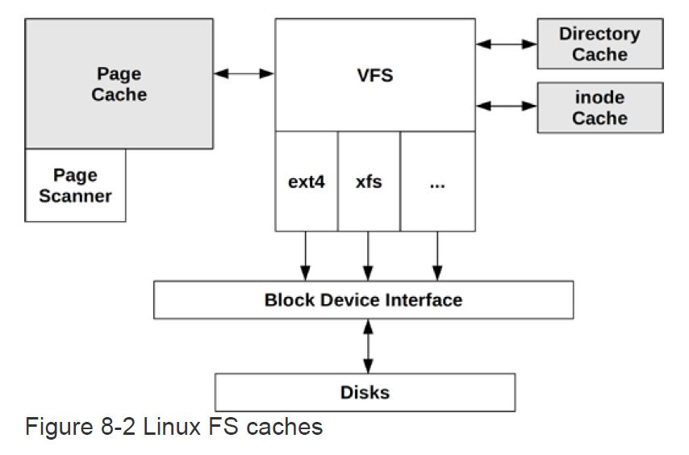
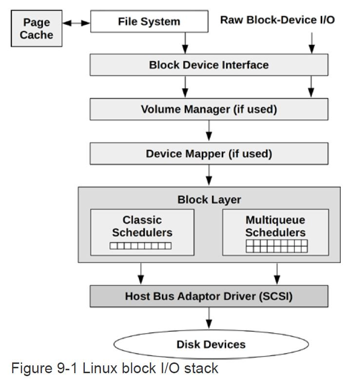
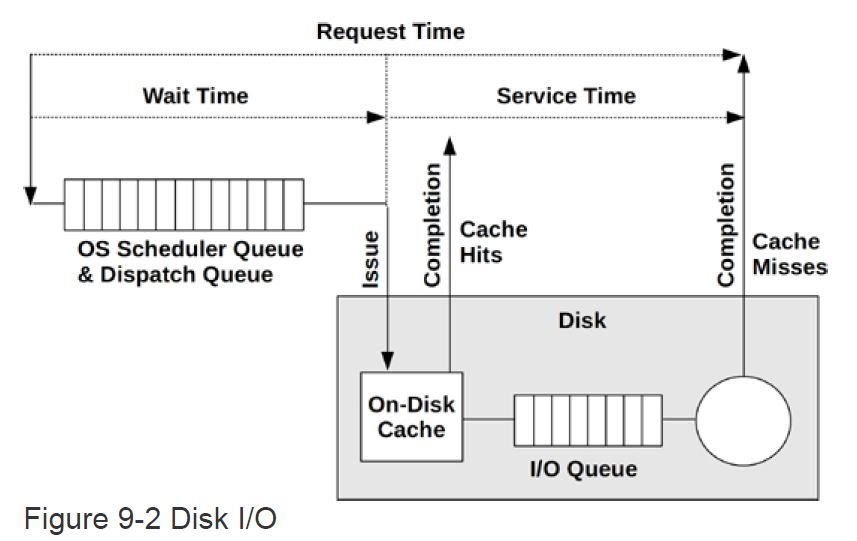

Disk Performance Debugging
---

- [Filesystem Basic](#filesystem-basic)
  - [I/O stack](#io-stack)
  - [VFS](#vfs)
- [Filesystem Classical Tools](#filesystem-classical-tools)
  - [df](#df)
  - [mount](#mount)
  - [strace](#strace)
  - [perf](#perf)
  - [fatrace](#fatrace)
- [Filesystem BPF Tools](#filesystem-bpf-tools)
  - [opensnoop](#opensnoop)
  - [statsnoop](#statsnoop)
  - [syncsnoop](#syncsnoop)
  - [mmapfles](#mmapfles)
  - [scread](#scread)
  - [fmapfault](#fmapfault)
  - [filelife](#filelife)
  - [vfsstat](#vfsstat)
  - [vfscount](#vfscount)
  - [vfssize](#vfssize)
  - [fsrwstat](#fsrwstat)
  - [fileslower](#fileslower)
  - [filetop](#filetop)
  - [filetype](#filetype)
  - [writesync](#writesync)
  - [cachestat](#cachestat)
  - [writeback](#writeback)
  - [dcstat](#dcstat)
  - [dcsnoop](#dcsnoop)
  - [mountsnoop](#mountsnoop)
  - [xfsslower](#xfsslower)
  - [xfsdist](#xfsdist)
  - [ext4dist](#ext4dist)
  - [icstat](#icstat)
  - [bufgrow](#bufgrow)
  - [## readahead](#-readahead)
- [Disk IO Basic](#disk-io-basic)
  - [Block IO Stack](#block-io-stack)
  - [RWBS](#rwbs)
  - [IO Scheduler](#io-scheduler)
  - [Disk IO Performance](#disk-io-performance)
- [Disk IO Classical Tools](#disk-io-classical-tools)
  - [iostat](#iostat)
  - [Perf](#perf-1)
- [Disk IO BPF Tools](#disk-io-bpf-tools)
  - [biolatency](#biolatency)
  - [biosnoop](#biosnoop)
  - [biotop](#biotop)
  - [bitesize](#bitesize)
  - [seeksize](#seeksize)
  - [biopattern](#biopattern)
  - [biostacks](#biostacks)
  - [bioerr](#bioerr)
  - [mdflush](#mdflush)
  - [iosched](#iosched)
  - [scsilatency](#scsilatency)
  - [scsiresult](#scsiresult)
  - [nvmelatency](#nvmelatency)

---
# Filesystem Basic
## I/O stack


## VFS
文件系统的服务接口称为虚拟文件系统层（VFS）, 它提供了一套通用的内核接口，可对接不同的文件系统(i.e: ext4, xfs ....)

* FS Cache
* Read-Ahead (预读取或预缓存)
* Write-Back (写回)
* 
# Filesystem Classical Tools
## df
```
[root@troubleshooting-env /]# df -h
Filesystem           Size  Used Avail Use% Mounted on
overlay               50G   31G   20G  62% /
tmpfs                 64M     0   64M   0% /dev
tmpfs                 32G     0   32G   0% /sys/fs/cgroup
/dev/mapper/cl-root   50G   31G   20G  62% /hostroot
tmpfs                 32G     0   32G   0% /hostroot/sys/fs/cgroup
devtmpfs              32G     0   32G   0% /hostroot/dev
tmpfs                 32G     0   32G   0% /dev/shm
tmpfs                 32G  515M   31G   2% /hostroot/run
tmpfs                6.3G     0  6.3G   0% /hostroot/run/user/0
/dev/sda1            976M  129M  781M  15% /hostroot/boot
/dev/mapper/cl-home  849G   43G  806G   6% /hostroot/home
tmpfs                 32G   12K   32G   1% /hostroot/var/lib/kubelet/pods/2fb5148b-8603-4962-850c-59c9b9dcfdb9/volumes/kubernetes.io~secret/calico-node-token-tmr7c
tmpfs                 32G   12K   32G   1% /hostroot/var/lib/kubelet/pods/12424783-8b97-4fc2-b267-7008a7c54f03/volumes/kubernetes.io~secret/kube-proxy-token-rcfql
```
## mount
···
[root@troubleshooting-env /]# mount
overlay on / type overlay (rw,relatime,seclabel,lowerdir=/var/lib/docker/overlay2/l/3WARWBOR2UO4K77AM25RGFEES6:/var/lib/docker/overlay2/l/QH3LLCNY7B7XRO3GUGVTETWA2F:/var/lib/docker/overlay2/l/BIAHPZMRJ2ZVNNW2NXKSJVHXVH:/var/lib/docker/overlay2/l/TUBUC4UMSW355LWVCIMTKT4IH3:/var/lib/docker/overlay2/l/JZP7DV5AMMZCXCGPJVNP33SV55:/var/lib/docker/overlay2/l/7HDCUARKU3GY5UC5LHZTPKLAEZ:/var/lib/docker/overlay2/l/ILXKRDSVFXBUSCJW7GU7VS67H3,upperdir=/var/lib/docker/overlay2/fb4c87d8dbefd6e8e168d97698edf9d05325db17469e9428e7f021422e6e2ab8/diff,workdir=/var/lib/docker/overlay2/fb4c87d8dbefd6e8e168d97698edf9d05325db17469e9428e7f021422e6e2ab8/work)
proc on /proc type proc (rw,nosuid,nodev,noexec,relatime)
tmpfs on /dev type tmpfs (rw,nosuid,seclabel,size=65536k,mode=755)
devpts on /dev/pts type devpts (rw,nosuid,noexec,relatime,seclabel,gid=5,mode=620,ptmxmode=666)
sysfs on /sys type sysfs (rw,nosuid,nodev,noexec,relatime,seclabel)
tmpfs on /sys/fs/cgroup type tmpfs (rw,nosuid,nodev,noexec,relatime,seclabel,mode=755)
···
  
Mount Parameters
* noatime
  
  No Access Time: performance optimization parameter by avoiding record access timestamp to improve disk performance

## strace
## perf
## fatrace
···
For RHEL 7 run the following as root:

cd /etc/yum.repos.d/
wget https://download.opensuse.org/repositories/server:monitoring/RHEL_7/server:monitoring.repo
yum install fatrace
···
# Filesystem BPF Tools
## opensnoop
```
[root@troubleshooting-env yum.repos.d]# opensnoop -eTp 6855
libbpf: bpf_prog_put is not found in vmlinux BTF
TIME(s)       PID    COMM               FD ERR FLAGS    PATH
0.000000000   6855   sla-monitoring     21   0 00100000 /proc/stat
0.000146000   6855   sla-monitoring     21   0 00100000 /etc/exthostname
0.000268000   6855   sla-monitoring     21   0 00100101 /iotests//testfile_0
0.000342000   6855   sla-monitoring     22   0 00100000 /etc/exthostname
0.000443000   6855   sla-monitoring     21   0 00100101 /iotests//testfile_1
0.000500000   6855   sla-monitoring     22   0 00100000 /etc/exthostname
0.000586000   6855   sla-monitoring     21   0 00100101 /iotests//testfile_2
0.000642000   6855   sla-monitoring     22   0 00100000 /etc/exthostname
0.000729000   6855   sla-monitoring     21   0 00100101 /iotests//testfile_3
```
## statsnoop
## syncsnoop
```
[root@troubleshooting-env yum.repos.d]# syncsnoop.bt
Attaching 7 probes...
Tracing sync syscalls... Hit Ctrl-C to end.
TIME      PID    COMM             EVENT
06:31:24  5785   elasticsearch[e  tracepoint:syscalls:sys_enter_fdatasync
06:31:24  5785   elasticsearch[e  tracepoint:syscalls:sys_enter_fdatasync
06:31:25  5785   elasticsearch[e  tracepoint:syscalls:sys_enter_fdatasync
06:31:25  5785   elasticsearch[e  tracepoint:syscalls:sys_enter_fdatasync
06:31:28  5785   elasticsearch[e  tracepoint:syscalls:sys_enter_fsync
06:31:28  5785   elasticsearch[e  tracepoint:syscalls:sys_enter_fsync
```
## mmapfles
## scread
## fmapfault
## filelife
tracking file created and deleted
```
[root@troubleshooting-env Ch08_FileSystems]# filelife
TIME     PID    COMM             AGE(s)  FILE
07:02:14 6855   sla-monitoring   0.00    testfile_0
07:02:14 6855   sla-monitoring   0.00    testfile_0
07:02:14 6855   sla-monitoring   0.00    testfile_1
07:02:14 6855   sla-monitoring   0.00    testfile_1
07:02:14 6855   sla-monitoring   0.00    testfile_2
07:02:14 6855   sla-monitoring   0.00    testfile_2
07:02:14 6855   sla-monitoring   0.00    testfile_3
```
## vfsstat
统计VFS调用：read/write, create, open and fsync

```
[root@troubleshooting-env Ch08_FileSystems]# vfsstat
libbpf: bpf_prog_put is not found in vmlinux BTF
TIME         READ/s  WRITE/s  FSYNC/s   OPEN/s CREATE/s
07:03:23:       626      414        0      187        0
07:03:24:       513      208        0      230        5
07:03:25:       523       98        0      208        0
07:03:26:      2675      196        0     1803        0
07:03:27:      1182      269        0      871        0
07:03:28:      2598      927        0     7202        0
07:03:29:      2074      588        0     2153        5
07:03:30:       865      420        0      355        0
07:03:31:      2124      497        0     8220        0
```
## vfscount
统计一定时间内VFS函数的调用次数
```
[root@troubleshooting-env Ch08_FileSystems]# vfscount
Tracing... Ctrl-C to end.
^C
ADDR             FUNC                          COUNT
ffffffffb06fc761 b'vfs_fsync_range'                1
ffffffffb06d5631 b'vfs_rename'                     1
ffffffffb06d7b21 b'vfs_path_lookup'                1
ffffffffb06d4a51 b'vfs_mknod'                      2
ffffffffb06c59c1 b'vfs_writev'                     5
ffffffffb06efa51 b'vfs_setxattr'                   6
ffffffffb06d4c81 b'vfs_create'                    10
ffffffffb06ff091 b'vfs_statfs'                    16
ffffffffb06c54f1 b'vfs_iter_read'                 23
ffffffffb06d5111 b'vfs_mkdir'                     36
ffffffffb06d4581 b'vfs_rmdir'                     36
ffffffffb06d46c1 b'vfs_unlink'                    42
ffffffffb06d1231 b'vfs_get_link'                  46
ffffffffb0725fe1 b'vfs_lock_file'                 66
ffffffffb06c59a1 b'vfs_iter_write'               107
ffffffffb06efff1 b'vfs_getxattr_alloc'           108
ffffffffb06ee9a1 b'vfs_getxattr'                 157
ffffffffb06d2b91 b'vfs_readlink'                 634
ffffffffb06c72d1 b'vfs_write'                   2317
ffffffffb06cb6f1 b'vfs_statx_fd'                8202
ffffffffb06c7031 b'vfs_read'                    9471
ffffffffb06c3701 b'vfs_open'                   11892
ffffffffb06cb771 b'vfs_statx'                  21214
ffffffffb06cb6b1 b'vfs_getattr'                43606
ffffffffb06cb631 b'vfs_getattr_nosec'          43722
```
## vfssize
## fsrwstat
## fileslower
显示延迟超过阈值的文件读写操作

## filetop
显示最频繁访问的文件

···
[root@troubleshooting-env Ch08_FileSystems]# filetop -C 5
Tracing... Output every 5 secs. Hit Ctrl-C to end

07:31:48 loadavg: 0.11 0.13 0.18 3/1812 1339056

TID    COMM             READS  WRITES R_Kb    W_Kb    T FILE
1704   dockerd          412    0      358     0       R 80d28bedfe5dec59da9ebf8e62602...
6865   dockerd          280    0      243     0       R 80d28bedfe5dec59da9ebf8e62602...
1348860 node_exporter    54     0      242     0       R core_id
1348860 node_exporter    30     0      134     0       R core_throttle_count
1339052 runc             2      0      127     0       R somaxconn
6859   sla-monitoring   12     0      95      0       R hostname
1718   dockerd          104    0      90      0       R 80d28bedfe5dec59da9ebf8e62602...
1348860 node_exporter    18     0      80      0       R physical_package_id
4257   dockerd          68     0      59      0       R 80d28bedfe5dec59da9ebf8e62602...
1691   kubelet          56     0      55      0       R memory.limit_in_bytes
1691   kubelet          50     0      49      0       R memory.soft_limit_in_bytes
6865   dockerd          4      0      48      0       R a89c91e8ff0853975d2558e4f20bd...
1339052 runc             12     0      48      0       R cpuinfo
1221172 prometheus       0      15     0       47      R 00000027
1691   kubelet          48     0      47      0       R memory.memsw.limit_in_bytes
6865   dockerd          4      0      45      0       R 4d4052823049a7be519c926132595...
6865   dockerd          4      0      44      0       R 4a75a37535c7ee3ce2b993dc1129d...
6865   dockerd          4      0      43      0       R 47a0b939434091d3285d36ca65102...
1691   kubelet          42     0      41      0       R cpu.cfs_quota_us
1691   kubelet          42     0      41      0       R cpu.cfs_period_us
···
## filetype
## writesync
## cachestat
## writeback
## dcstat
···
[root@troubleshooting-env Ch08_FileSystems]# dcstat
TIME         REFS/s   SLOW/s   MISS/s     HIT%
07:33:39:     31157      604      333    98.93
07:33:40:     25153       24        6    99.98
07:33:41:     40401      520      361    99.11
07:33:42:     34851        4        4    99.99
07:33:43:     18932       15        4    99.98
07:33:44:     25822      258       45    99.83
07:33:45:     27536      483       14    99.95
07:33:46:     54488      164       67    99.88
07:33:47:     20632      158       18    99.91
07:33:48:     30969      134       84    99.73
07:33:49:     42435      642      330    99.22
07:33:50:     25688       23        7    99.97
···
## dcsnoop
## mountsnoop
## xfsslower
## xfsdist
···
[root@troubleshooting-env Ch08_FileSystems]# xfsdist
Tracing XFS operation latency... Hit Ctrl-C to end.
^C

operation = b'write'
     usecs               : count     distribution
         0 -> 1          : 306      |****************************************|
         2 -> 3          : 32       |****                                    |
         4 -> 7          : 16       |**                                      |
         8 -> 15         : 19       |**                                      |
        16 -> 31         : 15       |*                                       |
        32 -> 63         : 3        |                                        |
        64 -> 127        : 0        |                                        |
       128 -> 255        : 0        |                                        |
       256 -> 511        : 0        |                                        |
       512 -> 1023       : 0        |                                        |
      1024 -> 2047       : 0        |                                        |
      2048 -> 4095       : 0        |                                        |
      4096 -> 8191       : 1        |                                        |

operation = b'read'
     usecs               : count     distribution
         0 -> 1          : 1613     |****************************************|
         2 -> 3          : 154      |***                                     |
         4 -> 7          : 24       |                                        |
         8 -> 15         : 10       |                                        |

operation = b'open'
     usecs               : count     distribution
         0 -> 1          : 934      |****************************************|
         2 -> 3          : 12       |                                        |
         4 -> 7          : 9        |                                        |
         8 -> 15         : 1        |                                        |
···
## ext4dist
## icstat
## bufgrow
## readahead
---
# Disk IO Basic
## Block IO Stack


## RWBS
* R: Read
* W: Write
* M: Metadata
* S: Synchronous
* A: Read-ahead
* F: Flush or force unit access
* D: Discard
* E: Erase
* N: None

## IO Scheduler
I/O is queued and scheduled in the block layer, either by classic schedulers (only present in Linux versions older than 5.0) or by the newer multi-queue schedulers

* Classical Scheduler
  * noop: No scheduling
  * Deadline: Enforce a latency deadline, useful for real-time systems
  * CFQ: completely fair queueing scheduler, which allocates I/O time slices to  processes, similar to CPU scheduling

* Multiple Queues Scheduler
  * None
  * BFQ: budget fair queueing scheduler similar to CFQ, but
allocates bandwidth as well as I/O time
  * mq-deadline: A blk-mq version of deadline
  * Kyber: A scheduler that adjusts read and write dispatch queue lengths based on performance, so that target read or write latencies can be met

## Disk IO Performance


# Disk IO Classical Tools
## iostat
```
[root@troubleshooting-env Ch08_FileSystems]# iostat -dx 1
Linux 4.18.0-193.el8.x86_64 (troubleshooting-env)       02/19/2021      _x86_64_        (32 CPU)

Device            r/s     w/s     rkB/s     wkB/s   rrqm/s   wrqm/s  %rrqm  %wrqm r_await w_await aqu-sz rareq-sz wareq-sz  svctm  %util
sda              0.44    3.31     24.13    186.00     0.00     2.62   0.14  44.26    5.12   58.56   0.19    55.45    56.28   0.79   0.29
dm-0             0.42    5.91     23.61    185.39     0.00     0.00   0.00   0.00    5.14   57.05   0.34    55.80    31.34   0.46   0.29
dm-1             0.00    0.00      0.02      0.00     0.00     0.00   0.00   0.00    6.81    0.00   0.00    21.57     0.00   0.71   0.00
dm-2             0.01    0.01      0.13      0.61     0.00     0.00   0.00   0.00    3.73   39.94   0.00    12.36    41.80   0.70   0.00

Device            r/s     w/s     rkB/s     wkB/s   rrqm/s   wrqm/s  %rrqm  %wrqm r_await w_await aqu-sz rareq-sz wareq-sz  svctm  %util
sda              0.00    0.00      0.00      0.00     0.00     0.00   0.00   0.00    0.00    0.00   0.00     0.00     0.00   0.00   0.00
dm-0             0.00    0.00      0.00      0.00     0.00     0.00   0.00   0.00    0.00    0.00   0.00     0.00     0.00   0.00   0.00
dm-1             0.00    0.00      0.00      0.00     0.00     0.00   0.00   0.00    0.00    0.00   0.00     0.00     0.00   0.00   0.00
dm-2             0.00    0.00      0.00      0.00     0.00     0.00   0.00   0.00    0.00    0.00   0.00     0.00     0.00   0.00   0.00

Device            r/s     w/s     rkB/s     wkB/s   rrqm/s   wrqm/s  %rrqm  %wrqm r_await w_await aqu-sz rareq-sz wareq-sz  svctm  %util
sda              0.00    0.00      0.00      0.00     0.00     0.00   0.00   0.00    0.00    0.00   0.00     0.00     0.00   0.00   0.00
dm-0             0.00    0.00      0.00      0.00     0.00     0.00   0.00   0.00    0.00    0.00   0.00     0.00     0.00   0.00   0.00
dm-1             0.00    0.00      0.00      0.00     0.00     0.00   0.00   0.00    0.00    0.00   0.00     0.00     0.00   0.00   0.00
dm-2             0.00    0.00      0.00      0.00     0.00     0.00   0.00   0.00    0.00    0.00   0.00     0.00     0.00   0.00   0.00
```
* rrqm/s: Read requests queued and merged per second
* wrqm/s: Write requests queued and merged per second
* r/s: Read requests completed per second (after merges)
* w/s: Write requests completed per second (after merges)
* rkB/s: Kbytes read from the disk device per second
* wkB/s: Kbytes written to the disk device per second
* avgrq-sz: Average request size in sectors (512 bytes).
* avgqu-sz: Average number of requests both waiting in the driver request queue and active on the device.
* await: Average I/O request time (aka response time), including time waiting in the driver request queue and the I/O response time of the device (ms).
* r_await: Same as await, but for reads only (ms).
* w_await: Same as await, but for writes only (ms).
* svctm: Average (inferred) I/O response time for the disk device(ms).
* %util: Percentage of time device was busy processing I/O requests (utilization).

## Perf

# Disk IO BPF Tools
## biolatency
```
[root@troubleshooting-env Ch08_FileSystems]# biolatency
Tracing block device I/O... Hit Ctrl-C to end.
^C
     usecs               : count     distribution
         0 -> 1          : 0        |                                        |
         2 -> 3          : 0        |                                        |
         4 -> 7          : 0        |                                        |
         8 -> 15         : 0        |                                        |
        16 -> 31         : 0        |                                        |
        32 -> 63         : 0        |                                        |
        64 -> 127        : 0        |                                        |
       128 -> 255        : 0        |                                        |
       256 -> 511        : 0        |                                        |
       512 -> 1023       : 0        |                                        |
      1024 -> 2047       : 0        |                                        |
      2048 -> 4095       : 4        |********************************        |
      4096 -> 8191       : 0        |                                        |
      8192 -> 16383      : 0        |                                        |
     16384 -> 32767      : 5        |****************************************|
```
## biosnoop
```
[root@troubleshooting-env Ch08_FileSystems]# biosnoop
TIME(s)     COMM           PID    DISK    T SECTOR     BYTES  LAT(ms)
0.000000    ?              0              R 0          1         3.59
2.047956    ?              0              R 0          0         3.53
4.095944    ?              0              R 0          1         3.57
6.143980    ?              0              R 0          0         3.59
8.191845    ?              0              R 0          1         3.51
9.042393    kworker/u130:2 1391243         R 485        29       21.85
9.044105    kworker/u130:2 1391243         R 486        30       23.56
10.239973   ?              0              R 0          0         3.56
11.591951   xfsaild/dm-0   836            R 398        44       11.07
11.593314   kworker/29:2   1399132         R 199        31       12.79
11.594173   xfsaild/dm-0   836            R 399        49       13.29
11.600711   xfsaild/dm-0   836            R 395        41       19.83
11.609105   xfsaild/dm-0   836            R 386        32       28.25
11.609232   xfsaild/dm-0   836            R 393        39       28.36
11.617432   xfsaild/dm-0   836            R 387        33       36.57
11.620554   xfsaild/dm-0   836            R 391        37       39.68
11.624859   xfsaild/dm-0   836            R 396        42       43.98
```
## biotop
## bitesize
## seeksize
## biopattern
## biostacks
## bioerr
## mdflush
## iosched
## scsilatency
## scsiresult
## nvmelatency