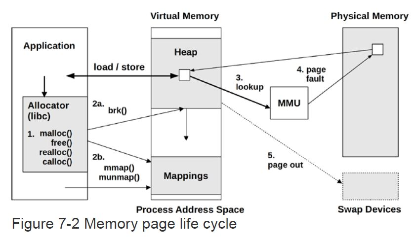

Memory Performence Debugging
---
- [Memory Basic](#memory-basic)
  - [Terms](#terms)
  - [Memory Management](#memory-management)
- [Memory Classical Tools](#memory-classical-tools)
  - [dmesg](#dmesg)
  - [swapon](#swapon)
  - [free](#free)
  - [ps](#ps)
  - [pmap](#pmap)
  - [vmstat](#vmstat)
  - [sar](#sar)
  - [perf](#perf)
- [BPF Tools](#bpf-tools)
  - [oomkill](#oomkill)
  - [memleak](#memleak)
  - [mmapsnoop](#mmapsnoop)
  - [brkstack](#brkstack)
  - [shmsnoop](#shmsnoop)
  - [faults](#faults)
  - [ffaults](#ffaults)
  - [vmscan](#vmscan)
  - [drsnoop](#drsnoop)
  - [swapin](#swapin)
  - [hfaults](#hfaults)

# Memory Basic

## Terms
* RSS (Resident Set Size)
  
  进程所使用的所有物理内存的数量
* 换页
  
  将内存页写入换页设备然后释放内存，称之为换页

* 虚拟内存

  每个进程和内核具有巨大的, 线性的, 并且私有的地址空间

* Page-in and Page-out
  * 文件系统换页
  
    读写位于内存中的映射文件页引发。 映射文件页被修改称之为“脏页” (dirty page)

  * 匿名换页
    
    进程的私有数据（堆，栈） - swapping
  
* 物理内存的按需映射
  映射： 虚存 <-> 主存

  当访问一个尚未从虚拟内存映射到物理内存的页时，会发生**缺页**

* 进程地址空间

  一段范围的虚拟页由硬件和软件同时管理，按需映射到物理页

  

## Memory Management
* Pageout Daemon (页换出守护进程)
当系统内存使用超过一定水平时，kswapd寻找可以释放的内存页
  * 文件系统页
  * Dirty Page
  * 应用程序内存页（anonymouns memory)
* Swap Device (物理换页设备)
appllicatin will be slower...

* OOM Killer 

  kill process except init (1) which has lot of memory when memory is shortage

* 页压缩
  
  defragment

* 文件系统缓存和缓冲区
  vm.swappniess来调整优先释放文件系统缓存还是其他内存。
  却决于应用类型：
    * 如果是文件操作侧重的系统，提高系统缓存有助于提高系统性能
    * 如果是少量文件操作的系统，减少文件系统缓存有助于提高系统性能
* 
# Memory Classical Tools
## dmesg
Using dmesg to check if there is OOM Killer 
* 内存用量信息
* 进程表
* Killed target process

## swapon
check if there is swap device

## free
```
[root@foss-ssc-7 bin]# free -mw
              total        used        free      shared     buffers       cache   available
Mem:          64114        3078       58744          66           3        2288       60375
Swap:             0           0           0
[root@foss-ssc-7 bin]#
```
## ps
```
[root@foss-ssc-7 bin]# ps aux
USER         PID %CPU %MEM    VSZ   RSS TTY      STAT START   TIME COMMAND
root           1  0.6  0.0 245376 14232 ?        Ss   11:45   1:56 /usr/lib/systemd/systemd --switched-root --system --deserialize 17
...
root        1239  0.0  0.0  16896  2124 ?        Ss   11:45   0:00 /usr/sbin/mcelog --ignorenodev --daemon --foreground
root        1246  0.0  0.0 124972  5444 ?        Ssl  11:45   0:02 /usr/sbin/irqbalance --foreground
dbus        1274  0.3  0.0  83036  6116 ?        Ssl  11:45   1:01 /usr/bin/dbus-daemon --system --address=systemd: --nofork --nopidfile --systemd-activation --syslog-only
libstor+    1275  0.0  0.0  18876  2060 ?        Ss   11:45   0:00 /usr/bin/lsmd -d
chrony      1277  0.0  0.0  29464  2572 ?        S    11:45   0:00 /usr/sbin/chronyd
root        1278  0.0  0.0 422208 14184 ?        Ss   11:45   0:00 /usr/sbin/sssd -i --logger=files
root        1279  0.0  0.0  26068  4104 ?        Ss   11:45   0:00 /usr/sbin/smartd -n -q never
polkitd     1280  0.0  0.0 2031472 24472 ?       Ssl  11:45   0:06 /usr/lib/polkit-1/polkitd --no-debug
root        1282  0.0  0.0 600524 20452 ?        Ssl  11:45   0:01 /usr/sbin/NetworkManager --no-daemon
```
## pmap
```
[root@foss-ssc-7 bin]# pmap -x 1246
1246:   /usr/sbin/irqbalance --foreground
Address           Kbytes     RSS   Dirty Mode  Mapping
000056247ffd3000      52      52       0 r-x-- irqbalance
00005624801e0000       4       4       4 r---- irqbalance
00005624801e1000       4       4       4 rw--- irqbalance
0000562481e39000     532     380     380 rw---   [ anon ]
00007f51e4000000     132       4       4 rw---   [ anon ]
00007f51e4021000   65404       0       0 -----   [ anon ]
00007f51e8a33000       4       0       0 -----   [ anon ]
00007f51e8a34000    8192       8       8 rw---   [ anon ]
00007f51e9234000      28      28       0 r-x-- libffi.so.6.0.2
00007f51e923b000    2048       0       0 ----- libffi.so.6.0.2
00007f51e943b000       4       4       4 r---- libffi.so.6.0.2
00007f51e943c000       4       4       4 rw--- libffi.so.6.0.2
00007f51e943d000     600      76       0 r-x-- libgmp.so.10.3.2
00007f51e94d3000    2044       0       0 ----- libgmp.so.10.3.2
00007f51e96d2000       8       8       8 r---- libgmp.so.10.3.2
00007f51e96d4000       4       4       4 rw--- libgmp.so.10.3.2
00007f51e96d5000     184      64       0 r-x-- libhogweed.so.4.5
00007f51e9703000    2048       0       0 ----- libhogweed.so.4.5
00007f51e9903000       4       4       4 r---- libhogweed.so.4.5
00007f51e9904000       4       0       0 rw---   [ anon ]
00007f51e9905000     220     172       0 r-x-- libnettle.so.6.5
00007f51e993c000    2044       0       0 ----- libnettle.so.6.5
00007f51e9b3b000       8       8       8 r---- libnettle.so.6.5
00007f51e9b3d000       4       4       4 rw--- libnettle.so.6.5
00007f51e9b3e000      72      64       0 r-x-- libtasn1.so.6.5.5
00007f51e9b50000    2044       0       0 ----- libtasn1.so.6.5.5
00007f51e9d4f000       4       4       4 r---- libtasn1.so.6.5.5
00007f51e9d50000       4       4       4 rw--- libtasn1.so.6.5.5
00007f51e9d51000    1524     120       0 r-x-- libunistring.so.2.1.0
00007f51e9ece000    2044       0       0 ----- libunistring.so.2.1.0
00007f51ea0cd000      16      16      16 r---- libunistring.so.2.1.0
00007f51ea0d1000       4       4       4 rw--- libunistring.so.2.1.0
00007f51ea0d2000     112      60       0 r-x-- libidn2.so.0.3.6
00007f51ea0ee000    2048       0       0 ----- libidn2.so.0.3.6
00007f51ea2ee000       4       4       4 r---- libidn2.so.0.3.6
00007f51ea2ef000       4       0       0 rw---   [ anon ]
00007f51ea2f0000    1148     312       0 r-x-- libp11-kit.so.0.3.0
00007f51ea40f000    2044       0       0 ----- libp11-kit.so.0.3.0
00007f51ea60e000      44      44      44 r---- libp11-kit.so.0.3.0
00007f51ea619000      40      40      40 rw--- libp11-kit.so.0.3.0
00007f51ea623000      12      12       0 r-x-- libdl-2.28.so
00007f51ea626000    2044       0       0 ----- libdl-2.28.so
00007f51ea825000       4       4       4 r---- libdl-2.28.so
00007f51ea826000       4       4       4 rw--- libdl-2.28.so
00007f51ea827000     108     100       0 r-x-- libpthread-2.28.so
00007f51ea842000    2044       0       0 ----- libpthread-2.28.so
00007f51eaa41000       4       4       4 r---- libpthread-2.28.so
00007f51eaa42000       4       4       4 rw--- libpthread-2.28.so
00007f51eaa43000      16       4       4 rw---   [ anon ]
00007f51eaa47000     448      60       0 r-x-- libpcre.so.1.2.10
00007f51eaab7000    2044       0       0 ----- libpcre.so.1.2.10
00007f51eacb6000       4       4       4 r---- libpcre.so.1.2.10
00007f51eacb7000       4       4       4 rw--- libpcre.so.1.2.10
00007f51eacb8000    1704     976       0 r-x-- libgnutls.so.30.24.0
00007f51eae62000    2044       0       0 ----- libgnutls.so.30.24.0
00007f51eb061000      68      68      68 r---- libgnutls.so.30.24.0
00007f51eb072000       4       4       4 rw--- libgnutls.so.30.24.0
00007f51eb073000       4       4       4 rw---   [ anon ]
00007f51eb074000    1764    1384       0 r-x-- libc-2.28.so
00007f51eb22d000    2048       0       0 ----- libc-2.28.so
00007f51eb42d000      16      16      16 r---- libc-2.28.so
00007f51eb431000       8       8       8 rw--- libc-2.28.so
00007f51eb433000      16      12      12 rw---   [ anon ]
00007f51eb437000     164      64       0 r-x-- libtinfo.so.6.1
00007f51eb460000    2044       0       0 ----- libtinfo.so.6.1
00007f51eb65f000      16      16      16 r---- libtinfo.so.6.1
00007f51eb663000       4       4       4 rw--- libtinfo.so.6.1
00007f51eb664000     240      64       0 r-x-- libncursesw.so.6.1
00007f51eb6a0000    2044       0       0 ----- libncursesw.so.6.1
00007f51eb89f000       4       4       4 r---- libncursesw.so.6.1
00007f51eb8a0000       4       4       4 rw--- libncursesw.so.6.1
00007f51eb8a1000      44      44       0 r-x-- libnuma.so.1.0.0
00007f51eb8ac000    2044       0       0 ----- libnuma.so.1.0.0
00007f51ebaab000       4       4       4 r---- libnuma.so.1.0.0
00007f51ebaac000       4       4       4 rw--- libnuma.so.1.0.0
00007f51ebaad000    1540     256       0 r-x-- libm-2.28.so
00007f51ebc2e000    2044       0       0 ----- libm-2.28.so
00007f51ebe2d000       4       4       4 r---- libm-2.28.so
00007f51ebe2e000       4       4       4 rw--- libm-2.28.so
00007f51ebe2f000    1112     516       0 r-x-- libglib-2.0.so.0.5600.4
00007f51ebf45000    2048       0       0 ----- libglib-2.0.so.0.5600.4
00007f51ec145000       4       4       4 r---- libglib-2.0.so.0.5600.4
00007f51ec146000       4       4       4 rw--- libglib-2.0.so.0.5600.4
00007f51ec147000       4       0       0 rw---   [ anon ]
00007f51ec148000      20      20       0 r-x-- libcap-ng.so.0.0.0
00007f51ec14d000    2044       0       0 ----- libcap-ng.so.0.0.0
00007f51ec34c000       4       4       4 r---- libcap-ng.so.0.0.0
00007f51ec34d000       4       4       4 rw--- libcap-ng.so.0.0.0
00007f51ec34e000     164     164       0 r-x-- ld-2.28.so
00007f51ec566000      40      40      40 rw---   [ anon ]
00007f51ec576000       4       4       4 r---- ld-2.28.so
00007f51ec577000       4       4       4 rw--- ld-2.28.so
00007f51ec578000       4       4       4 rw---   [ anon ]
00007ffe2485b000     132      32      32 rw---   [ stack ]
00007ffe248f9000      12       0       0 r----   [ anon ]
00007ffe248fc000       8       4       0 r-x--   [ anon ]
ffffffffff600000       4       0       0 r-x--   [ anon ]
---------------- ------- ------- -------
total kB          124976    5448     836
[root@foss-ssc-7 bin]#
```
## vmstat
```
[root@foss-ssc-7 bin]# vmstat 1
procs -----------memory---------- ---swap-- -----io---- -system-- ------cpu-----
 r  b   swpd   free   buff  cache   si   so    bi    bo   in   cs us sy id wa st
 3  0      0 60138756   3264 2355920    0    0     3     2   17   36  1  2 97  0  0
 2  0      0 60140364   3264 2355952    0    0     0    12 31361 31689  2  6 92  0  0
 2  0      0 60137224   3264 2356068    0    0     0  1300 34344 42099  3  6 91  0  0
 2  0      0 60137380   3264 2356084    0    0     0     0 30152 30658  2  6 92  0  0
 2  0      0 60139852   3264 2356084    0    0     0     0 24157 33777  2  6 92  0  0
 ```
## sar
```
[root@foss-ssc-7 bin]# sar -B 1
Linux 4.18.0-193.el8.x86_64 (foss-ssc-7)        02/18/2021      _x86_64_        (32 CPU)

04:58:04 PM  pgpgin/s pgpgout/s   fault/s  majflt/s  pgfree/s pgscank/s pgscand/s pgsteal/s    %vmeff
04:58:05 PM      0.00      0.00 286075.00      0.00 229539.00      0.00      0.00      0.00      0.00
04:58:06 PM      0.00      0.00 286267.00      0.00 229994.00      0.00      0.00      0.00      0.00
04:58:07 PM      0.00      0.00 287846.00      0.00 230956.00      0.00      0.00      0.00      0.00
04:58:08 PM      0.00      0.00 286385.00      0.00 229819.00      0.00      0.00      0.00      0.00
04:58:09 PM      0.00      0.00 298263.00      0.00 252650.00      0.00      0.00      0.00      0.00
04:58:10 PM      0.00      0.00 285416.00      0.00 229069.00      0.00      0.00      0.00      0.00
04:58:11 PM      0.00      0.00 285706.00      0.00 229175.00      0.00      0.00      0.00      0.00
04:58:12 PM      0.00      0.00 284509.00      0.00 228590.00      0.00      0.00      0.00      0.00
04:58:13 PM      0.00      0.00 285482.00      0.00 229457.00      0.00      0.00      0.00      0.00
04:58:14 PM      0.00      0.00 285760.00      0.00 233734.00      0.00      0.00      0.00      0.00
04:58:15 PM      0.00      0.00 285112.00      0.00 229321.00      0.00      0.00      0.00      0.00
```
## perf

# BPF Tools
## oomkill
Tracking OOM event

## memleak
Trace outstanding memory allocations that weren't freed. Supports both **user-mode** (-p) allocations made with **libc** functions and **kernel-mode** (no -p) allocations made with **kmalloc/kmem_cache_alloc/get_free_pages** and corresponding memory release functions.

```
[root@troubleshooting-env Ch07_Memory]# memleak -p 1212420
Attaching to pid 1212420, Ctrl+C to quit.
[05:31:00] Top 10 stacks with outstanding allocations:
        1000 bytes in 1 allocations from stack
                main+0x1c [ml]
                __libc_start_main+0xf3 [libc-2.28.so]
                [unknown]
[05:31:05] Top 10 stacks with outstanding allocations:
        1000 bytes in 1 allocations from stack
                main+0x1c [ml]
                __libc_start_main+0xf3 [libc-2.28.so]
                [unknown]
[05:31:10] Top 10 stacks with outstanding allocations:
        2000 bytes in 2 allocations from stack
                main+0x1c [ml]
                __libc_start_main+0xf3 [libc-2.28.so]
                [unknown]
```

## mmapsnoop
Trace mmap(2) calls
## brkstack
Count brk(2) syscalls with user stacks
```
   trace -U t:syscalls:sys_enter_brk
   stackcount -PU t:syscalls:sys_enter_brk
   ./brkstack.bt (located in book repo)
```
## shmsnoop
Trace shmget, shmat, shmdt, shmctl

## faults
Count page faults with user/kernel stacks
```
   stackcount -U t:exceptions:page_fault_user
   stackcount -U t:exceptions:page_fault_kernel
   ./faults.bt
```
## ffaults
Count page faults by filename.

## vmscan
Measure VM scanner shrink and reclaim times:q
```
[root@troubleshooting-env Ch07_Memory]# pwd
/root/bpf-perf-tools-book-master/originals/Ch07_Memory
[root@troubleshooting-env Ch07_Memory]# ./vmscan.bt
Attaching 10 probes...
TIME         S-SLABms  D-RECLAIMms  M-RECLAIMms KSWAPD WRITEPAGE
05:24:17            0            0            0      0         0
05:24:18            0            0            0      0         0
05:24:19            0            0            0      0         0
05:24:20            0            0            0      0         0
05:24:21            0            0            0      0         0
```
## drsnoop
## swapin
## hfaults

