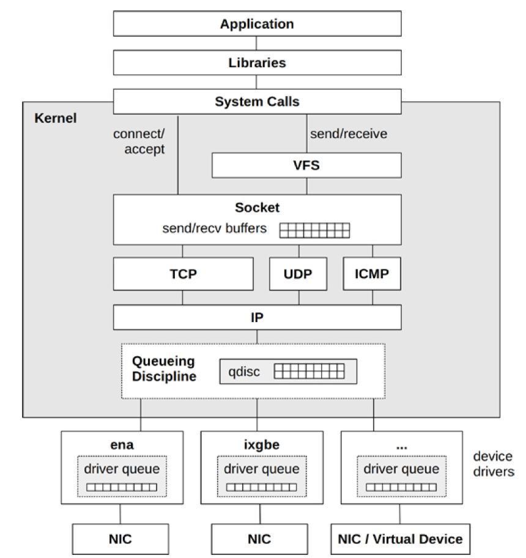
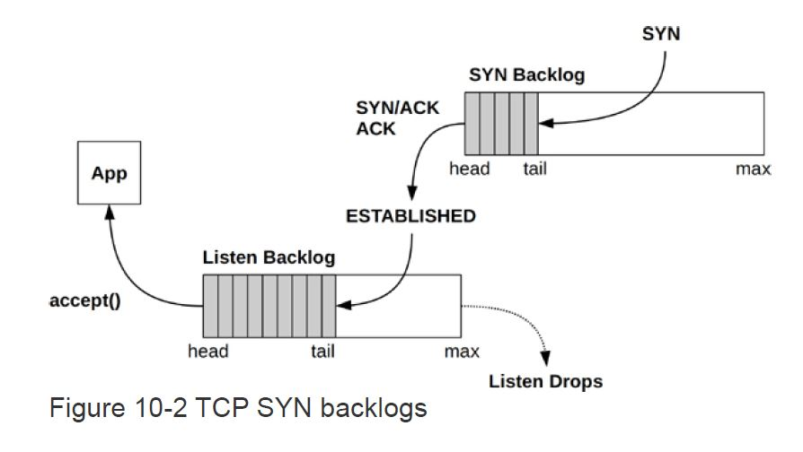

Network Performance Debugging
---

- [Network Basics](#network-basics)
  - [Network Stack](#network-stack)
  - [Kernel Bypass (DPDK)](#kernel-bypass-dpdk)
  - [BPF-Based XDP](#bpf-based-xdp)
  - [Key Internal Structure](#key-internal-structure)
  - [Receive and Transmit Scaling](#receive-and-transmit-scaling)
  - [Socket Accept Scaling](#socket-accept-scaling)
  - [TCP Backlogs - TCP积压队列](#tcp-backlogs---tcp积压队列)
- [Network Classical Tools](#network-classical-tools)
- [Network BPF Tools](#network-bpf-tools)

# Network Basics
## Network Stack


## Kernel Bypass (DPDK)
Applications can bypass the kernel network stack using technologies such as the Data Plane Development Kit (DPDK) for achieving higher packet rates and performance. This involves an application implementing its own network protocols in user-space, and making writes to the network driver via a DPDK library and a kernel user space I/O (UIO) or virtual function I/O (VFIO) driver. The expense of copying packet data can be avoided by directly accessing memory on the NIC.

## BPF-Based XDP
The eXpress Data Path (XDP) technology provides another path fornetwork packets: a programmable fast path that uses extended BPF, and which integrates into the existing kernel stack rather than bypassing it. Because it accesses the raw network Ethernet frame as early as possible via a BPF hook inside the NIC driver, it can make early decisions about forwarding or dropping without the overhead of TCP/IP stack processing. When needed, it can also fall back to regular network stack processing. Use cases include faster DDoS mitigation, and software-defined routing.

## Key Internal Structure
* sk_buff
* sock
* tcp_sock
* tcp_prot
* udp_prot

## Receive and Transmit Scaling
Without a CPU load-balancing strategy for network packets, a NIC may only interrupt one CPU, which can drive it to 100% utilization in interrupt and network stack processing, becoming a bottleneck

Various policies are available for interrupt mitigation and distributing NIC interrupts and packet processing across multiple CPUs, improving scalability and performance

* New API Interface (NAPI)
* Receive Side Scaling (RSS) - 接收方缩放技术
* Receive Packet Steering (RPS) - 入报导向技术
* Receive Flow Steering (RFS) - 入流导向技术
* Accelerated RFS - 硬件加速RFS技术
* Transmit Packet Steering (XPS) - 出报导向技术
  
## Socket Accept Scaling
A commonly used model to handle high rates of passive TCP connections uses a thread to process the accept(2) calls and then pass the connection to a pool of worker threads

a **SO_REUSEPORT** setsockopt(3) option was added in Linux 3.9 that allows a pool of processes or threads to bind to the same socket address, where they all can call accept(2). It is then up to the kernel to balance the new connections across the pool of bound threads. 

A BPF program can be supplied to steer this balancing via the SO_ATTACH_REUSEPORT_EBPF option: this was added for UDP in Linux 4.5, and TCP in Linux 4.6.

## TCP Backlogs - TCP积压队列


```
[root@troubleshooting-env Ch09_Disks]# sysctl net.ipv4.tcp_max_syn_backlog
net.ipv4.tcp_max_syn_backlog = 2048
[root@troubleshooting-env Ch09_Disks]# sysctl net.core.somaxconn
net.core.somaxconn = 128
```

# Network Classical Tools
# Network BPF Tools