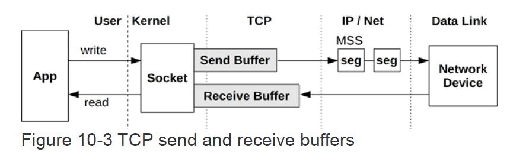
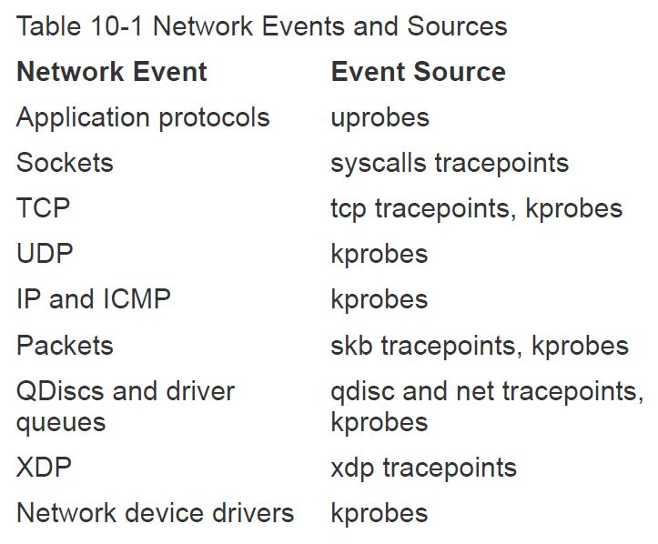

Network Performance Debugging
---

- [Network Basics](#network-basics)
  - [Network Stack](#network-stack)
  - [Kernel Bypass (DPDK)](#kernel-bypass-dpdk)
  - [BPF-Based XDP](#bpf-based-xdp)
  - [Key Internal Structure](#key-internal-structure)
  - [Receive and Transmit Scaling](#receive-and-transmit-scaling)
  - [Socket Accept Scaling](#socket-accept-scaling)
  - [TCP Backlogs - TCP积压队列](#tcp-backlogs---tcp积压队列)
  - [TCP Retransmits](#tcp-retransmits)
  - [TCP Send and Receive Buffers](#tcp-send-and-receive-buffers)
  - [Queueing Discipline (队列管理器)](#queueing-discipline-队列管理器)
  - [BPF Instrument Event](#bpf-instrument-event)
- [Network Classical Tools](#network-classical-tools)
  - [ss](#ss)
  - [ip](#ip)
  - [nstat](#nstat)
  - [netstat](#netstat)
  - [sar](#sar)
  - [ethtool](#ethtool)
  - [tcpdump](#tcpdump)
- [Network BPF Tools](#network-bpf-tools)
  - [sockstat](#sockstat)
  - [sofamily](#sofamily)
  - [soprotocol](#soprotocol)
  - [soconnect](#soconnect)
  - [soaccept](#soaccept)
  - [socketio](#socketio)
  - [socksize](#socksize)
  - [sormem](#sormem)
  - [soconnlat](#soconnlat)
  - [so1stbyte](#so1stbyte)
  - [tcpconnect](#tcpconnect)
  - [tcpaccept](#tcpaccept)
  - [tcplife](#tcplife)
  - [tcptop](#tcptop)
  - [tcpretrans](#tcpretrans)
  - [tcpsynbl](#tcpsynbl)
  - [tcpwin](#tcpwin)
  - [tcpnagle](#tcpnagle)
  - [udpconnect](#udpconnect)
  - [gethostlatency](#gethostlatency)
  - [ipecn](#ipecn)
  - [superping](#superping)
  - [qdisc-fq(...)](#qdisc-fq)
  - [netsize](#netsize)
  - [nettxlat](#nettxlat)
  - [nettxlat-dev](#nettxlat-dev)
  - [skbdrop](#skbdrop)
  - [skblife](#skblife)
  - [ieee80211scan](#ieee80211scan)

# Network Basics
## Network Stack


## Kernel Bypass (DPDK)
Applications can bypass the kernel network stack using technologies such as the Data Plane Development Kit (DPDK) for achieving higher packet rates and performance. This involves an application implementing its own network protocols in user-space, and making writes to the network driver via a DPDK library and a kernel user space I/O (UIO) or virtual function I/O (VFIO) driver. The expense of copying packet data can be avoided by directly accessing memory on the NIC.

## BPF-Based XDP
The eXpress Data Path (XDP) technology provides another path fornetwork packets: a programmable fast path that uses extended BPF, and which integrates into the existing kernel stack rather than bypassing it. Because it accesses the raw network Ethernet frame as early as possible via a BPF hook inside the NIC driver, it can make early decisions about forwarding or dropping without the overhead of TCP/IP stack processing. When needed, it can also fall back to regular network stack processing. Use cases include faster DDoS mitigation, and software-defined routing.

## Key Internal Structure
* sk_buff
* sock
* tcp_sock
* tcp_prot
* udp_prot

## Receive and Transmit Scaling
Without a CPU load-balancing strategy for network packets, a NIC may only interrupt one CPU, which can drive it to 100% utilization in interrupt and network stack processing, becoming a bottleneck

Various policies are available for interrupt mitigation and distributing NIC interrupts and packet processing across multiple CPUs, improving scalability and performance

* New API Interface (NAPI)
* Receive Side Scaling (RSS) - 接收方缩放技术
* Receive Packet Steering (RPS) - 入报导向技术
* Receive Flow Steering (RFS) - 入流导向技术
* Accelerated RFS - 硬件加速RFS技术
* Transmit Packet Steering (XPS) - 出报导向技术
  
## Socket Accept Scaling
A commonly used model to handle high rates of passive TCP connections uses a thread to process the accept(2) calls and then pass the connection to a pool of worker threads

a **SO_REUSEPORT** setsockopt(3) option was added in Linux 3.9 that allows a pool of processes or threads to bind to the same socket address, where they all can call accept(2). It is then up to the kernel to balance the new connections across the pool of bound threads. 

A BPF program can be supplied to steer this balancing via the SO_ATTACH_REUSEPORT_EBPF option: this was added for UDP in Linux 4.5, and TCP in Linux 4.6.

## TCP Backlogs - TCP积压队列


```
[root@troubleshooting-env Ch09_Disks]# sysctl net.ipv4.tcp_max_syn_backlog
net.ipv4.tcp_max_syn_backlog = 2048
[root@troubleshooting-env Ch09_Disks]# sysctl net.core.somaxconn
net.core.somaxconn = 128
```

## TCP Retransmits
* Timer-based retransmits (定时重传)TCP_RTO_MIN)
  ACK报超时重传，第一次重传至少200ms（TCP_RTO_MIN), later 加倍时间重传
  ```
  #define TCP_RTO_MAX     ((unsigned)(120*HZ))
  #define TCP_RTO_MIN     ((unsigned)(HZ/5))
  ```
  ```
  net.ipv4.tcp_retries1 = 3
  net.ipv4.tcp_retries2 = 15

  tcp_retries1 - INTEGER
	This value influences the time, after which TCP decides, that
	something is wrong due to unacknowledged RTO retransmissions,
	and reports this suspicion to the network layer.
	See tcp_retries2 for more details.

	RFC 1122 recommends at least 3 retransmissions, which is the
	default.

  tcp_retries2 - INTEGER
	This value influences the timeout of an **alive** TCP connection,
	when RTO retransmissions remain unacknowledged.
	Given a value of N, a hypothetical TCP connection following
	exponential backoff with an initial RTO of TCP_RTO_MIN would
	retransmit N times before killing the connection at the (N+1)th RTO.

	The default value of 15 yields a hypothetical timeout of 924.6
	seconds and is a lower bound for the effective timeout.
	TCP will effectively time out at the first RTO which exceeds the
	hypothetical timeout.

	RFC 1122 recommends at least 100 seconds for the timeout,
	which corresponds to a value of at least 8.
  ```
* Fast Retransmits (快速重传)
  when duplicated ACK received, retransmit immediately

## TCP Send and Receive Buffers

* GSO
* GRO
* TSO

## Queueing Discipline (队列管理器)
* tc

## BPF Instrument Event


# Network Classical Tools
## ss
```
[root@troubleshooting-env /]# ss -tiepm
State                   Recv-Q                 Send-Q                                            Local Address:Port                                                     Peer Address:Port

SYN-SENT                0                      1                                                  10.9.249.231:42315                                                    10.9.249.229:bgp
 users:(("bird",pid=4371,fd=9)) timer:(on,1.104ms,1) ino:33952645 sk:1 <->
         skmem:(r0,rb87380,t1280,tb16384,f2816,w1280,o0,bl0,d0) cubic rto:2000 backoff:1 mss:524 pmtu:1500 rcvmss:88 advmss:1460 cwnd:1 ssthresh:7 segs_out:1 lastsnd:172233408 lastrcv:172233408 lastack:172233408 unacked:1 lost:1 rcv_ssthresh:29200
ESTAB                   0                      0                                               135.252.135.247:43438                                                       10.96.0.1:https
 users:(("calico-typha",pid=3581,fd=7)) timer:(keepalive,21sec,0) uid:999 ino:53416 sk:2 <->
         skmem:(r0,rb1007048,t0,tb87040,f0,w0,o0,bl0,d0) ts sack cubic wscale:7,7 rto:205 rtt:4.496/6.248 ato:40 mss:1448 pmtu:1500 rcvmss:1448 advmss:1448 cwnd:10 bytes_sent:595135 bytes_acked:595136 bytes_received:77829676 segs_out:35697 segs_in:77801 data_segs_out:14810 data_segs_in:69488 send 25.8Mbps lastsnd:8312 lastrcv:8310 lastack:8310 pacing_rate 51.5Mbps delivery_rate 75.5Mbps delivered:14811 app_limited busy:68092ms rcv_rtt:1932.26 rcv_space:146071 rcv_ssthresh:503076 minrtt:0.107
ESTAB                   0                      0                                                  10.9.249.231:39245                                                    10.9.249.228:bgp
 users:(("bird",pid=4371,fd=11)) ino:30257528 sk:3 <->
         skmem:(r0,rb367360,t0,tb87040,f4096,w0,o0,bl0,d0) ts sack cubic wscale:7,7 rto:201 rtt:0.235/0.029 ato:40 mss:1448 pmtu:1500 rcvmss:536 advmss:1448 cwnd:10 bytes_sent:13628 bytes_acked:13629 bytes_received:13552 segs_out:1394 segs_in:1395 data_segs_out:699 data_segs_in:695 send 492.9Mbps lastsnd:27566 lastrcv:5949 lastack:5949 pacing_rate 985.3Mbps delivery_rate 120.7Mbps delivered:700 app_limited busy:324ms rcv_space:29200 rcv_ssthresh:30272 minrtt:0.096
```
## ip
## nstat
```
[root@troubleshooting-env /]# nstat
#kernel
IpInReceives                    5935               0.0
IpForwDatagrams                 4563               0.0
IpInDelivers                    1372               0.0
IpOutRequests                   6222               0.0
IcmpInMsgs                      47                 0.0
IcmpInErrors                    23                 0.0
IcmpInDestUnreachs              47                 0.0
IcmpOutMsgs                     90                 0.0
IcmpOutDestUnreachs             90                 0.0
IcmpMsgInType3                  47                 0.0
IcmpMsgOutType3                 90                 0.0
TcpActiveOpens                  71                 0.0
TcpPassiveOpens                 16                 0.0
TcpAttemptFails                 40                 0.0
TcpInSegs                       1357               0.0
TcpOutSegs                      12437              0.0
TcpRetransSegs                  23                 0.0
TcpOutRsts                      86                 0.0
Ip6InReceives                   32                 0.0
Ip6InDelivers                   32                 0.0
Ip6OutRequests                  32                 0.0
Ip6InOctets                     2240               0.0
Ip6OutOctets                    2240               0.0
Ip6InNoECTPkts                  32                 0.0
TcpExtTW                        23                 0.0
TcpExtDelayedACKs               10                 0.0
TcpExtDelayedACKLost            19                 0.0
TcpExtTCPHPHits                 140                0.0
TcpExtTCPPureAcks               729                0.0
TcpExtTCPHPAcks                 209                0.0
TcpExtTCPTimeouts               23                 0.0
TcpExtTCPLossProbes             17                 0.0
TcpExtTCPDSACKOldSent           19                 0.0
TcpExtTCPRcvCoalesce            13                 0.0
TcpExtTCPSpuriousRtxHostQueues  23                 0.0
TcpExtTCPAutoCorking            41                 0.0
TcpExtTCPSynRetrans             23                 0.0
TcpExtTCPOrigDataSent           12068              0.0
TcpExtTCPKeepAlive              1                  0.0
TcpExtTCPDelivered              12100              0.0
IpExtInOctets                   4723976            0.0
IpExtOutOctets                  24629065           0.0
IpExtInNoECTPkts                8840               0.0
```
## netstat
```
[root@troubleshooting-env /]# netstat -i
Kernel Interface table
Iface             MTU    RX-OK RX-ERR RX-DRP RX-OVR    TX-OK TX-ERR TX-DRP TX-OVR Flg
cali269ecccce3c  1410  1093361      0      0 0       1093361      0      0      0 BMRU
cali294f7cd2c2b  1410        0      0      0 0             0      0      0      0 BMRU
cali2fb7f4e858c  1410  1093361      0      0 0       1093361      0      0      0 BMRU
cali3f7a02c716a  1410  1093361      0      0 0       1093361      0      0      0 BMRU
cali82bc72d9c56  1410  1093361      0      0 0       1093361      0      0      0 BMRU
cali8352cb04046  1410    99462      0      0 0            11      0      0      0 BMRU
cali85f8d8e2355  1410        0      0      0 0             0      0      0      0 BMRU
cali975248ac421  1410  1093361      0      0 0       1093361      0      0      0 BMRU
cali99d2eb6a2ea  1410  4365626      0      0 0       4512804      0      0      0 BMRU
calia364187c910  1410  1093361      0      0 0       1093361      0      0      0 BMRU
calice8e413f5ed  1410  4365626      0      0 0       4512804      0      0      0 BMRU
calidc658aebb98  1410        0      0      0 0             0      0     60      0 BMRU
calif520de2f72a  1410        0      0      0 0             0      0     60      0 BMRU
docker0          1500   247289      0      0 0        426827      0      0      0 BMU
eno1             1500 17642341      0      0 0      25054033      0      0      0 BMRU
eno2             1500        0      0      0 0             0      0      0      0 BMU
eno3             1500    99462      0      0 0            11      0      0      0 BMRU
eno4             1500  4365626      0      0 0       4512804      0      0      0 BMRU
lo              65536  1093361      0      0 0       1093361      0      0      0 LRU
vxlan.calico     1410        0      0      0 0             0      0     60      0 BMRU
[root@troubleshooting-env /]#
```
```
netstat -apn
netstat -s
```
## sar
The networking options to sar(1) are:
* -n DEV: Network interface statistics
* -n EDEV: Network interface errors
* -n IP,IP6: IPv4 and IPv6 datagram statistics
* -n EIP,EIP6: IPv4 and IPv6 error statistics
* -n ICMP,ICMP6: ICMP IPv4 and IPv6 statistics
* -n EICMP,EICMP6: ICMP IPv4 and IPv6 error statistics
* -n TCP: TCP statistics
* -n ETCP: TCP error statistics
* -n SOCK,SOCK6: IPv4 and IPv6 socket usage
```
[root@troubleshooting-env /]# sar -n SOCK 1
Linux 4.18.0-193.el8.x86_64 (troubleshooting-env)       02/20/2021      _x86_64_        (32 CPU)

03:56:21 AM    totsck    tcpsck    udpsck    rawsck   ip-frag    tcp-tw
03:56:22 AM       374        26         2         0         0        32
03:56:23 AM       373        25         2         0         0        32
03:56:24 AM       374        26         2         0         0        32
```
## ethtool
## tcpdump

# Network BPF Tools
## sockstat
tracking statistics on socket, accept, bind, connect, sendmsg and recvmsg based on probe

```
[root@troubleshooting-env Ch10_Networking]# ./sockstat.bt
Attaching 10 probes...
Tracing sock statistics. Output every 1 second.
05:14:23
@[tracepoint:syscalls:sys_enter_bind]: 1
@[tracepoint:syscalls:sys_enter_accept4]: 2
@[tracepoint:syscalls:sys_enter_socket]: 3
@[tracepoint:syscalls:sys_enter_connect]: 3
@[kprobe:sock_sendmsg]: 183
@[kprobe:sock_recvmsg]: 332

05:14:24
@[tracepoint:syscalls:sys_enter_bind]: 1
@[tracepoint:syscalls:sys_enter_accept4]: 2
@[tracepoint:syscalls:sys_enter_accept]: 2
@[tracepoint:syscalls:sys_enter_socket]: 6
@[tracepoint:syscalls:sys_enter_connect]: 6
@[kprobe:sock_sendmsg]: 320
@[kprobe:sock_recvmsg]: 604

05:14:25
@[tracepoint:syscalls:sys_enter_accept4]: 2
@[tracepoint:syscalls:sys_enter_socket]: 3
@[tracepoint:syscalls:sys_enter_connect]: 4
@[tracepoint:syscalls:sys_enter_accept]: 18
@[kprobe:sock_sendmsg]: 150
@[kprobe:sock_recvmsg]: 196
```
```
[root@troubleshooting-env Ch10_Networking]# bpftrace -e 'kprobe:sock_sendmsg { @[comm] = count() }'
Attaching 1 probe...
^C

@[systemd-udevd]: 1
@[docker]: 1
@[kube-proxy]: 2
@[ipset]: 2
@[katib-controlle]: 2
@[runc:[2:INIT]]: 3
@[metrics-collect]: 4
@[python]: 6
@[sssd_nss]: 8
@[calico-typha]: 8
@[runc:[1:CHILD]]: 9
@[civetweb-worker]: 9
@[runc:[0:PARENT]]: 9
@[grpc_health_pro]: 10
@[node_exporter]: 11
@[logctrl-d]: 16
@[elasticsearch[e]: 23
@[node]: 23
@[bird6]: 27
@[containerd-shim]: 29
@[bird]: 32
@[prometheus]: 49
@[ip]: 56
@[coredns]: 84
@[calico-node]: 87
@[containerd]: 138
@[iptables]: 161
@[sla-monitoring]: 180
@[dockerd]: 344
@[kube-state-metr]: 361
@[iptables-nft-sa]: 371
@[runc]: 490
@[logeventhandler]: 689
@[kubelet]: 1272
@[systemd]: 1518
@[dbus-daemon]: 1804
```
## sofamily
tracking statistics of accept and connect based on comm, SO FAMILY

```
[root@troubleshooting-env Ch10_Networking]# ./sofamily.bt
Attaching 7 probes...
Tracing socket connect/accepts. Ctrl-C to end.
^C

@accept[python, 2, AF_INET]: 1
@accept[elasticsearch[e, 2, AF_INET]: 1
@accept[kube-state-metr, 10, AF_INET6]: 1
@accept[dockerd, 1, AF_UNIX]: 2
@accept[prometheus, 2, AF_INET]: 2
@accept[civetweb-master, 2, AF_INET]: 2
@accept[calico-typha, 2, AF_INET]: 2
@accept[calico-node, 2, AF_INET]: 2
@accept[containerd, 1, AF_UNIX]: 2
@accept[sssd_nss, 1, AF_UNIX]: 2
@accept[coredns, 10, AF_INET6]: 13
@accept[dbus-daemon, 1, AF_UNIX]: 24

@connect[grpc_health_pro, 2, AF_INET]: 1
@connect[calico-node, 2, AF_INET]: 2
@connect[node, 2, AF_INET]: 2
@connect[calico-node, 10, AF_INET6]: 2
@connect[kubelet, 1, AF_UNIX]: 2
@connect[calico-node, 1, AF_UNIX]: 3
@connect[kubelet, 10, AF_INET6]: 6
@connect[containerd, 1, AF_UNIX]: 8
@connect[coredns, 2, AF_INET]: 10
@connect[kubelet, 2, AF_INET]: 12
@connect[logctrl-d, 2, AF_INET]: 12
@connect[bird, 2, AF_INET]: 13
@connect[prometheus, 2, AF_INET]: 13
@connect[runc, 1, AF_UNIX]: 24
```
## soprotocol
```
[root@troubleshooting-env Ch10_Networking]# ./soprotocol.bt
Attaching 4 probes...
Tracing socket connect/accepts. Ctrl-C to end.
^C

@connect[calico-node, 0, IPPROTO_IP, TCPv6]: 1
@connect[calico-node, 110, , TCP]: 1
@connect[logctrl-d, 110, , UNIX]: 1
@connect[calico-node, 95, , TCP]: 1
@connect[grpc_health_pro, 95, , TCP]: 2
@connect[calico-node, 110, , UDPv6]: 2
@connect[coredns, 110, , UDP]: 2
@connect[calico-node, 110, , TCPv6]: 2
@connect[calico-node, 110, , UDP]: 2
@connect[calico-node, 0, IPPROTO_IP, UDPv6]: 2
@connect[calico-node, 95, , UDPv6]: 2
@connect[calico-node, 95, , TCPv6]: 3
@connect[calico-node, 95, , UDP]: 4
@connect[kubelet, 95, , UDPv6]: 4
@connect[grpc_health_pro, 110, , TCP]: 4
@connect[kubelet, 0, IPPROTO_IP, UDPv6]: 4
@connect[kubelet, 0, IPPROTO_IP, TCPv6]: 4
@connect[kubelet, 95, , UDP]: 4
```
## soconnect
tracking connect actions and connect() latency
```
[root@troubleshooting-env Ch10_Networking]# ./soconnect.bt
Attaching 4 probes...
PID    PROCESS          FAM ADDRESS          PORT   LAT(us) RESULT
4371   bird             2   10.9.249.229     691          9
1218429 coredns          2   0.0.0.0          656         79 In progress
1219486 prometheus       2   192.168.21.234   656         55 In progress
2711769 grpc_health_pro  2   0.0.0.0          645         67 In progress
4371   bird             2   10.9.249.227     691         29
4371   bird             2   10.9.249.229     691         74 In progress
1218429 coredns          2   0.0.0.0          656        118 In progress
1219486 prometheus       2   192.168.94.218   541         88 In progress
1219486 prometheus       2   192.168.155.45   541         49 In progress
4371   bird             2   10.9.249.227     691         49 In progress
1218429 coredns          2   0.0.0.0          656         91 In progress
1219486 prometheus       2   192.168.94.219   541         87 In progress
4371   bird             2   10.9.249.229     691          8
1218429 coredns          2   0.0.0.0          656         70 In progress
4371   bird             2   10.9.249.227     691          7
1219486 prometheus       2   192.168.188.93   541         55 In progress
1219486 prometheus       2   135.252.135.245  652         45 In progress
1218429 coredns          2   0.0.0.0          656         49 In progress
5808   logctrl-d        2   10.96.0.10       565         10 Success
5808   logctrl-d        2   10.96.0.10       565          5 Success
5808   logctrl-d        2   10.96.0.10       565         13 Success
```
## soaccept
tracking accept actions

```
[root@troubleshooting-env Ch10_Networking]# vi soaccept.bt
[root@troubleshooting-env Ch10_Networking]# ./soaccept.bt
Attaching 6 probes...
PID    PROCESS          FAM ADDRESS          PORT  RESULT
1218429 coredns          10  ::ffff:127.0.0.1 838   Success
1219486 prometheus       2   135.252.135.247  748   Success
1218429 coredns          10  ::ffff:127.0.0.1 842   Success
1218239 kube-state-metr  10  ::ffff:135.252.135.247 1012  Success
7268   calico-node      2   127.0.0.1        698   Success
1218429 coredns          10  ::ffff:127.0.0.1 852   Success
1744967 civetweb-master  2   192.168.150.121  520   Success
3581   calico-typha     2   127.0.0.1        586   Success
```
## socketio
tracking statistics of sendmsg and recvmsg 

```
[root@troubleshooting-env Ch10_Networking]# ./socketio.bt
Attaching 2 probes...
^C

@io[sla-monitoring, 1744967, write, TCP, 42282]: 1
@io[sla-monitoring, 1744967, write, TCP, 42550]: 1
@io[sla-monitoring, 1744967, write, TCP, 42248]: 1
@io[calico-node, 2719305, write, TCP, 9099]: 1
@io[sla-monitoring, 1744967, write, TCP, 42846]: 1
@io[sla-monitoring, 1744967, write, TCP, 42246]: 1
@io[coredns, 1218429, write, TCPv6, 42516]: 1
@io[sla-monitoring, 1744967, write, TCP, 42832]: 1
@io[sla-monitoring, 1744967, write, TCP, 42986]: 1
@io[elasticsearch[e, 5785, write, TCP, 43196]: 1
@io[sla-monitoring, 1744967, write, TCP, 42672]: 1
@io[runc:[1:CHILD], 2719304, read, UNIX, 0]: 1
@io[civetweb-worker, 7143, read, TCP, 34474]: 1
@io[runc:[1:CHILD], 2719387, read, UNIX, 0]: 1
```
## socksize

```
[root@troubleshooting-env Ch10_Networking]# ./socksize.bt
Attaching 5 probes...
^C

@read_bytes[sshd]:
[32, 64)               1 |@@@@@@@@@@@@@@@@@@@@@@@@@@@@@@@@@@@@@@@@@@@@@@@@@@@@|

@read_bytes[node_exporter]:
[128, 256)             1 |@@@@@@@@@@@@@@@@@@@@@@@@@@@@@@@@@@@@@@@@@@@@@@@@@@@@|

@read_bytes[auditd]:
[32, 64)               3 |@@@@@@@@@@@@@@@@@@@@@@@@@@@@@@@@@@@@@@@@@@@@@@@@@@@@|

@read_bytes[node]:
[128, 256)             3 |@@@@@@@@@@@@@@@@@@@@@@@@@@@@@@@@@@@@@@@@@@@@@@@@@@@@|
[256, 512)             1 |@@@@@@@@@@@@@@@@@                                   |

@read_bytes[logctrl-d]:
[64, 128)              1 |@@@@@@@@@@@@@@@@@                                   |
[128, 256)             3 |@@@@@@@@@@@@@@@@@@@@@@@@@@@@@@@@@@@@@@@@@@@@@@@@@@@@|
```
replace hist() with stats()
```
[root@troubleshooting-env Ch10_Networking]# ./socksizestat.bt
Attaching 3 probes...
^C

@read_bytes[runc:[0:PARENT]]: count 4, average 4, total 16
@read_bytes[runc:[1:CHILD]]: count 1, average 4, total 4
@read_bytes[sssd_nss]: count 3, average 13, total 40
@read_bytes[NetworkManager]: count 7, average 28, total 196
@read_bytes[sshd]: count 1, average 36, total 36
@read_bytes[runc]: count 338, average 56, total 19155
@read_bytes[python]: count 4, average 59, total 239
@read_bytes[auditd]: count 1, average 63, total 63
@read_bytes[exe]: count 2, average 84, total 169
@read_bytes[systemd]: count 480, average 93, total 44898
@read_bytes[gdbus]: count 48, average 98, total 4740
@read_bytes[calico-typha]: count 1, average 108, total 108
@read_bytes[calico-node]: count 2, average 108, total 216
@read_bytes[coredns]: count 24, average 126, total 3028
@read_bytes[grpc_health_pro]: count 2, average 128, total 256
@read_bytes[dockerd]: count 40, average 134, total 5397
@read_bytes[systemd-logind]: count 144, average 212, total 30534
@read_bytes[dbus-daemon]: count 484, average 231, total 111918
@read_bytes[containerd]: count 34, average 241, total 8217
@read_bytes[node]: count 4, average 247, total 988
@read_bytes[systemd-journal]: count 24, average 331, total 7950
@read_bytes[syslogger]: count 205, average 339, total 69588
```
## sormem
Show socket receive buffer usage and overflows
```
[root@troubleshooting-env Ch10_Networking]# ./sormem.bt
Attaching 4 probes...
Tracing socket receive buffer size. Hit Ctrl-C to end.
^C

@rmem_alloc:
[0]                 6169 |@@@@@@@@@@@@@@@@@@@@@@@@@@@@@@@@@@@@@@@@@@@@@@@@@@@@|
[1]                    0 |                                                    |
[2, 4)                 0 |                                                    |
[4, 8)                 0 |                                                    |
[8, 16)                0 |                                                    |
[16, 32)               0 |                                                    |
[32, 64)               0 |                                                    |
[64, 128)              0 |                                                    |
[128, 256)             0 |                                                    |
[256, 512)             0 |                                                    |
[512, 1K)             99 |                                                    |
[1K, 2K)              17 |                                                    |
[2K, 4K)             150 |@                                                   |
[4K, 8K)             226 |@                                                   |
[8K, 16K)            122 |@                                                   |
[16K, 32K)           206 |@                                                   |
[32K, 64K)            90 |                                                    |
[64K, 128K)           16 |                                                    |
[128K, 256K)          27 |                                                    |
[256K, 512K)         152 |@                                                   |
[512K, 1M)           182 |@                                                   |
[1M, 2M)              47 |                                                    |

@rmem_limit:
[128K, 256K)        4382 |@@@@@@@@@@@@@@@@@@@@@@@@@@@@@@@@@@@@@@@@@@@@@@@@@@@@|
[256K, 512K)         538 |@@@@@@                                              |
[512K, 1M)             0 |                                                    |
[1M, 2M)             136 |@                                                   |
[2M, 4M)              17 |                                                    |
[4M, 8M)            1049 |@@@@@@@@@@@@                                        |
[8M, 16M)              0 |                                                    |
[16M, 32M)          1381 |@@@@@@@@@@@@@@@@                                    |
```
## soconnlat
Summarize IP socket connection latency with stacks
* EINPROGRESS
* != EINPROGRESS
```
tracepoint:syscalls:sys_exit_connect
/@conn_start[tid] && args->ret != - EINPROGRESS/
{
        $dur_us = (nsecs - @conn_start[tid]) / 1000;
        @us[@conn_stack[tid], comm] = hist($dur_us);
        delete(@conn_start[tid]);
        delete(@conn_stack[tid]);
}

tracepoint:syscalls:sys_exit_poll*,
tracepoint:syscalls:sys_exit_epoll*,
tracepoint:syscalls:sys_exit_select*,
tracepoint:syscalls:sys_exit_pselect*
/@conn_start[tid] && args->ret > 0/
{
        $dur_us = (nsecs - @conn_start[tid]) / 1000;
        @us[@conn_stack[tid], comm] = hist($dur_us);
        delete(@conn_start[tid]);
        delete(@conn_stack[tid]);
}
```
## so1stbyte
## tcpconnect
## tcpaccept
## tcplife
trace the lifespan of TCP sessions: showing their duration, address details, throughput, and when possible, the responsible process ID and name
```
[root@troubleshooting-env Ch10_Networking]# tcplife
PID   COMM       LADDR           LPORT RADDR           RPORT TX_KB RX_KB MS
0     swapper/20 192.168.150.113 8081  192.168.155.45  36342 5913968640     0 0.63
0     swapper/6  192.168.150.113 8081  192.168.155.45  36344 5913968640     0 0.53
0     swapper/20 192.168.150.113 8081  192.168.155.45  36346 5913968640     0 0.44
0     swapper/6  192.168.150.113 8081  192.168.155.45  36348 5913968640     0 0.39
0     swapper/20 192.168.150.113 8081  192.168.155.45  36350 5913968640     0 0.46
0     swapper/20 192.168.150.113 8081  192.168.155.45  36352 5913968640     0 0.52
0     swapper/6  192.168.150.113 8081  192.168.155.45  36354 5913968640     0 0.33
0     swapper/20 192.168.150.113 8081  192.168.155.45  36356 5913968640     0 0.47
0     swapper/6  192.168.150.113 8081  192.168.155.45  36358 5913968640     0 0.45
0     swapper/20 192.168.150.113 8081  192.168.155.45  36360 5913968640     0 0.34
1218429 coredns    127.0.0.1       58340 127.0.0.1       8080  274873712640     0 0.55
1218429 coredns    ::ffff:127.0.0.1 8080  ::ffff:127.0.0.1 58340 274873712640 155648 0.55
1219486 prometheus 192.168.150.121 46104 192.168.94.218  8989  5913968640     0 2.35
1219486 prometheus 192.168.150.121 56500 192.168.155.45  8989  5913968640     0 1.64
1218429 coredns    127.0.0.1       58346 127.0.0.1       8080  274873712640     0 0.54
1218429 coredns    ::ffff:127.0.0.1 8080  ::ffff:127.0.0.1 58346 274873712640 57344 0.56
```
## tcptop
```
[root@troubleshooting-env Ch10_Networking]# tcptop -C
Tracing... Output every 1 secs. Hit Ctrl-C to end

06:28:00 loadavg: 1.52 1.30 0.82 1/1814 2763196

PID    COMM         LADDR                 RADDR                  RX_KB  TX_KB
1219486 prometheus   192.168.150.121:50374 10.96.0.1:443             87      1
1219486 prometheus   192.168.150.121:52342 192.168.150.76:8989        2      0
7143   metrics-coll 192.168.150.76:8989   192.168.150.121:52342      0      2
3288   kube-proxy   135.252.135.247:43398 135.252.135.241:6443       1      0
1218239 kube-state-m 192.168.150.75:34638  10.96.0.1:443              1      0
5790   node         192.168.150.123:42158 10.103.253.87:9200         0      1
5785   java         192.168.150.72:9200   192.168.150.123:42158      1      0
1218429 coredns      192.168.150.118:36756 10.96.0.1:443              1      0
5785   java         192.168.150.72:9200   192.168.150.123:53870      0      0
5790   node         192.168.150.123:53870 10.103.253.87:9200         0      0
1218429 coredns      127.0.0.1:60360       127.0.0.1:8080             0      0
3581   calico-typha 127.0.0.1:9098        127.0.0.1:56764            0      0
1624   kubelet      127.0.0.1:56764       127.0.0.1:9098             0      0
2540332 sshd         135.252.135.247:22    10.242.128.32:59973        0      0
1744967 sla-monitori 192.168.150.113:8081  192.168.188.89:48656       0      0
1744967 sla-monitori 192.168.150.113:8081  192.168.188.89:48668       0      0
1744967 sla-monitori 192.168.150.113:8081  192.168.188.89:48666       0      0
```
## tcpretrans
## tcpsynbl
## tcpwin
## tcpnagle
## udpconnect
## gethostlatency
## ipecn
## superping
## qdisc-fq(...)
## netsize
## nettxlat
shows network device transmission latency: the time spent pushing the packet into the driver layer to enqueue it on a TX ring for the hardware to send out, until the hardware signals the kernel that packet transmission has completed (usually via NAPI)
and the packet is freed

```
tracepoint:net:net_dev_start_xmit
{
        @start[args->skbaddr] = nsecs;
}

tracepoint:skb:consume_skb
/@start[args->skbaddr]/
{
        @us = hist((nsecs - @start[args->skbaddr]) / 1000);
        delete(@start[args->skbaddr]);
}
```
```
[root@troubleshooting-env Ch10_Networking]# ./nettxlat.bt
Attaching 5 probes...
Tracing net device xmit queue latency. Hit Ctrl-C to end.
^C


@us:
[4, 8)                 1 |                                                    |
[8, 16)               10 |@@@                                                 |
[16, 32)               9 |@@@                                                 |
[32, 64)              24 |@@@@@@@@                                            |
[64, 128)            142 |@@@@@@@@@@@@@@@@@@@@@@@@@@@@@@@@@@@@@@@@@@@@@@@@@@@@|
[128, 256)            94 |@@@@@@@@@@@@@@@@@@@@@@@@@@@@@@@@@@                  |
[256, 512)             0 |                                                    |
[512, 1K)              0 |                                                    |
[1K, 2K)               0 |                                                    |
[2K, 4K)               0 |                                                    |
[4K, 8K)               0 |                                                    |
[8K, 16K)              0 |                                                    |
[16K, 32K)             0 |                                                    |
[32K, 64K)             0 |                                                    |
[64K, 128K)            1 |                                                    |
[128K, 256K)           0 |                                                    |
[256K, 512K)           2 |                                                    |
[512K, 1M)             6 |@@                                                  |
[1M, 2M)               1 |                                                    |
```
## nettxlat-dev
same with nettxlat but w/ dev
```
`[root@troubleshooting-env Ch10_Networking]# ./nettxlat-dev.bt
Attaching 5 probes...
Tracing net device xmit queue latency. Hit Ctrl-C to end.
^C


@us[lo]:
[16, 32)               1 |@@@@@@@@@@@@@                                       |
[32, 64)               3 |@@@@@@@@@@@@@@@@@@@@@@@@@@@@@@@@@@@@@@@             |
[64, 128)              4 |@@@@@@@@@@@@@@@@@@@@@@@@@@@@@@@@@@@@@@@@@@@@@@@@@@@@|

@us[eth0]:
[8, 16)                1 |@@@@@@@@                                            |
[16, 32)               1 |@@@@@@@@                                            |
[32, 64)               6 |@@@@@@@@@@@@@@@@@@@@@@@@@@@@@@@@@@@@@@@@@@@@@@@@@@@@|
[64, 128)              1 |@@@@@@@@                                            |

@us[]:
[8, 16)               19 |@@@@@@@@@@@@@@@@@@@@@@@@@@@@@@@@@@@@@@@@@@@@@@@@@@@@|
[16, 32)              18 |@@@@@@@@@@@@@@@@@@@@@@@@@@@@@@@@@@@@@@@@@@@@@@@@@   |
[32, 64)              14 |@@@@@@@@@@@@@@@@@@@@@@@@@@@@@@@@@@@@@@              |
[64, 128)              9 |@@@@@@@@@@@@@@@@@@@@@@@@                            |
[128, 256)             3 |@@@@@@@@                                            |
[256, 512)             0 |                                                    |
[512, 1K)              0 |                                                    |
[1K, 2K)               0 |                                                    |
[2K, 4K)               0 |                                                    |
[4K, 8K)               0 |                                                    |
[8K, 16K)              2 |@@@@@                                               |
[16K, 32K)             0 |                                                    |
[32K, 64K)             2 |@@@@@                                               |
[64K, 128K)            5 |@@@@@@@@@@@@@                                       |
[128K, 256K)           5 |@@@@@@@@@@@@@                                       |
[256K, 512K)           4 |@@@@@@@@@@                                          |
[512K, 1M)            10 |@@@@@@@@@@@@@@@@@@@@@@@@@@@                         |
[1M, 2M)               6 |@@@@@@@@@@@@@@@@                                    |
[2M, 4M)               1 |@@                                                  |

@us[eno1]:
[64, 128)             88 |@@@@@@@@@@@@@@@@@@@@@@@@@@@@@@@@@@@@@@@@@@@@@@@@@@@@|
[128, 256)            84 |@@@@@@@@@@@@@@@@@@@@@@@@@@@@@@@@@@@@@@@@@@@@@@@@@   |

@us[eno4]:
[64, 128)             99 |@@@@@@@@@@@@@@@@@@@@@@@@@@@@@@@@@@@@@@@@@@@@@@@@@@@@|
[128, 256)            72 |@@@@@@@@@@@@@@@@@@@@@@@@@@@@@@@@@@@@@               |
[256, 512)             0 |                                                    |
[512, 1K)              0 |                                                    |
```
## skbdrop
skb:kfree_skb tracepoint is a counterpart of skb:consume_skb. The consume_skb tracepoint fires for the normal skb consumption code path, and kfree_skb fires for other unusual events
```
./skbdrop.bt --unsafe
[root@troubleshooting-env Ch10_Networking]# ./skbdrop.bt
Attaching 3 probes...
Tracing unusual skb drop stacks. Hit Ctrl-C to end.
^C

@[
    kfree_skb+115
    kfree_skb+115
    unix_release_sock+422
    unix_release+25
    __sock_release+61
    sock_close+17
    __fput+183
    task_work_run+138
]: 1
@[
    kfree_skb+115
    kfree_skb+115
    unix_stream_connect+1279
    __sys_connect+208
    __x64_sys_connect+22
    do_syscall_64+91
    entry_SYSCALL_64_after_hwframe+101
]: 2
@[
    kfree_skb+115
    kfree_skb+115
    __neigh_event_send+165
    neigh_resolve_output+379
    ip_finish_output2+406
    ip_output+112
    ip_forward+931
    ip_rcv+627
]: 3
```
## skblife
## ieee80211scan