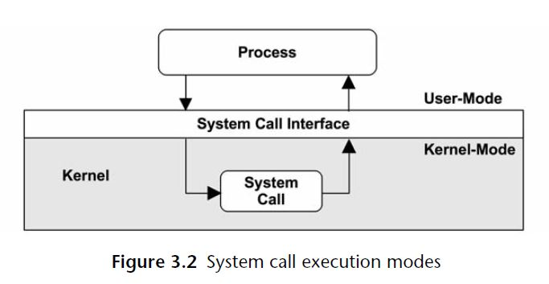
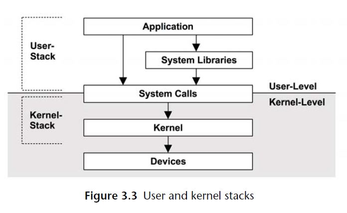

OS Concepts
---

- [Kernel](#kernel)
- [Stacks](#stacks)
- [Interrupts and Interrupt Threads](#interrupts-and-interrupt-threads)
- [Interrupt Priority Leel](#interrupt-priority-leel)
- [Process](#process)
- [System Calls](#system-calls)
- [Virtual Memory](#virtual-memory)
- [Memory Management](#memory-management)
- [Schedulers](#schedulers)
- [File Systems](#file-systems)
- [Caching](#caching)
- [Networking](#networking)
- [Device Drivers](#device-drivers)
- [Multiprocessor](#multiprocessor)
- [Preemption](#preemption)
- [Resource Management](#resource-management)
- [Observability](#observability)
- [System Configuration Variables](#system-configuration-variables)

# Kernel
* 内核态
* 用户态

ContextSwitch between Kernel and User Space


# Stacks
Stack inspection is an invaluable tool for debugging and performance analysis
* Kernel Stack
* User Stack
  

# Interrupts and Interrupt Threads
# Interrupt Priority Leel
# Process
# System Calls
# Virtual Memory
# Memory Management
# Schedulers
# File Systems
# Caching
# Networking
# Device Drivers
# Multiprocessor
# Preemption
# Resource Management
# Observability
# System Configuration Variables
```
[root@foss-ssc-7 ~]# getconf -a

[root@foss-ssc-7 ~]# getconf CLK_TCK
100
[root@foss-ssc-7 ~]#
```
